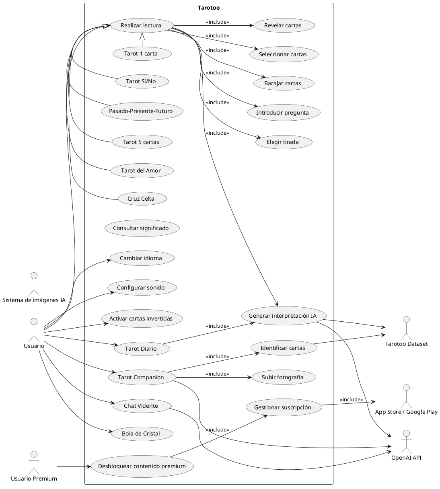
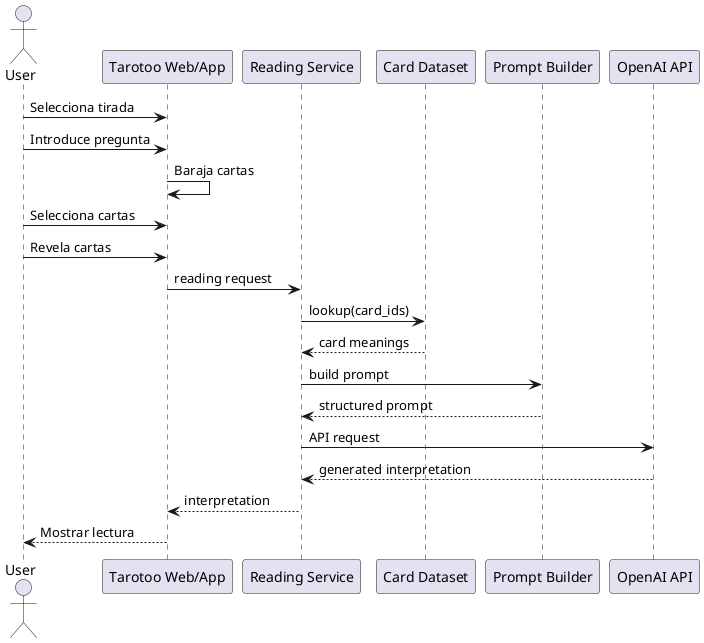
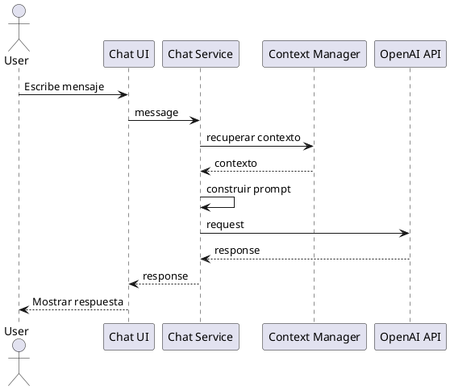
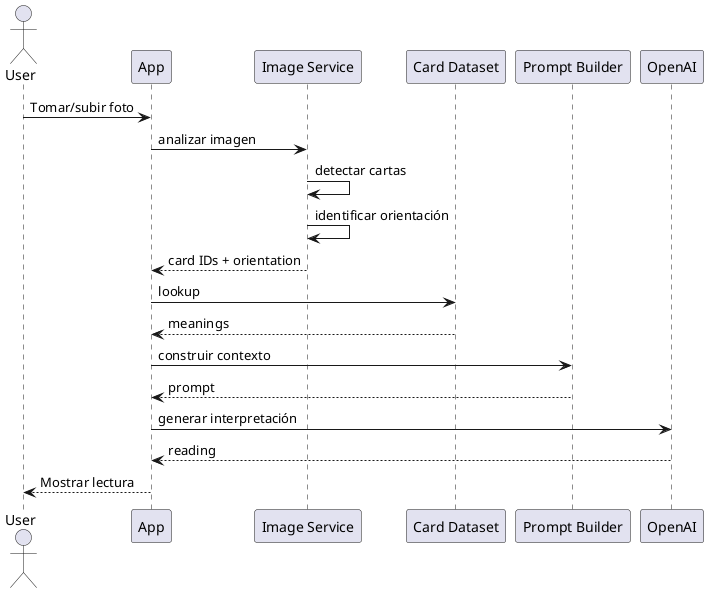
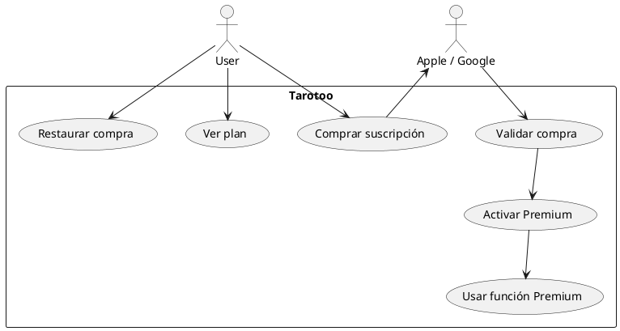
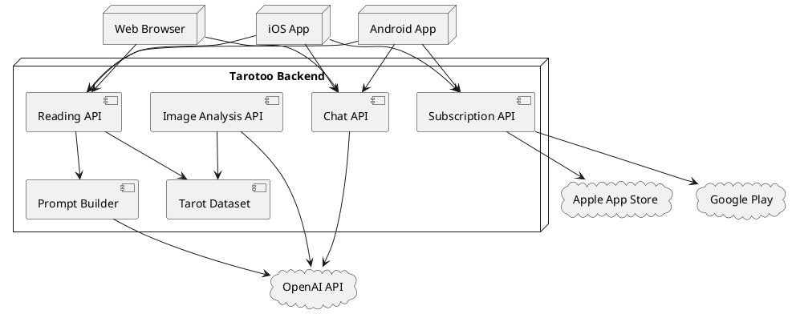
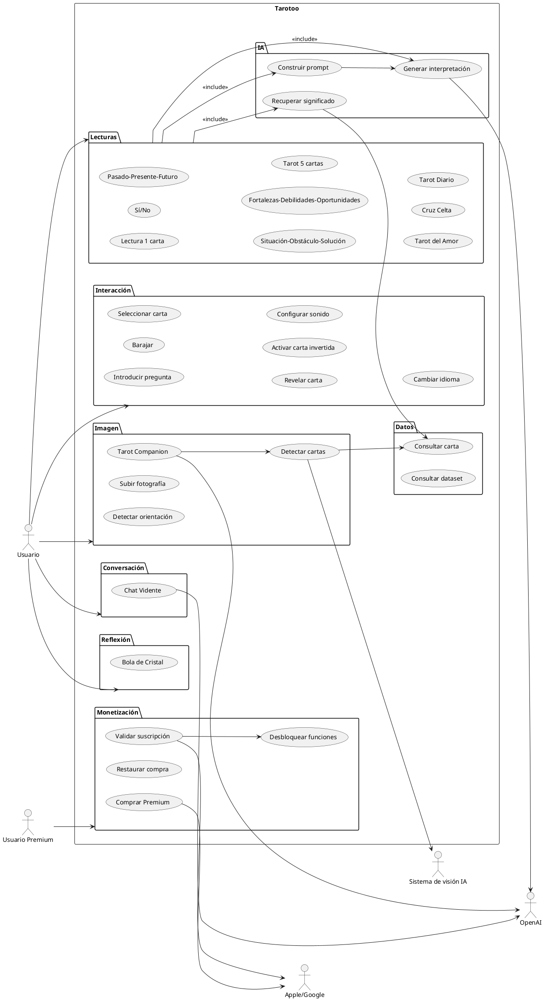

# TAROTOO — INFORME TÉCNICO MAESTRO

## Auditoría funcional, algoritmo de tarot con IA, arquitectura de datos, aplicaciones móviles, suscripciones y UML

---

# 1. Resumen ejecutivo

Tarotoo es una plataforma de tarot interactivo que combina:

- selección interactiva de cartas;
- simbolismo Rider–Waite–Smith;
- un dataset estructurado de las 78 cartas;
- generación de interpretaciones mediante IA;
- diferentes estructuras de tirada;
- Tarot Diario;
- Tarot del Amor;
- Tarot Sí/No;
- Tarot de una carta;
- Tarot de tres cartas;
- tiradas de cinco cartas;
- tiradas avanzadas en la aplicación;
- Cruz Celta;
- Chat Vidente;
- Tarot Companion para interpretar fotografías de una tirada física;
- Bola de Cristal como herramienta de reflexión;
- aplicación móvil;
- suscripciones y compras dentro de la aplicación;
- contenido educativo;
- dataset abierto y herramientas para desarrolladores.

La documentación pública permite afirmar algo especialmente importante:

> **Tarotoo no utiliza simplemente una tabla de significados y devuelve texto fijo. Su sistema público documentado utiliza una arquitectura de recuperación estructurada + prompt + modelo de lenguaje.**

La propia documentación describe el flujo como:

```text
Carta seleccionada
       ↓
lookup directo en dataset
       ↓
significados / keywords / atributos
       ↓
pregunta + tirada + posiciones + contexto
       ↓
prompt estructurado
       ↓
OpenAI API
       ↓
interpretación personalizada
```

Esto está documentado por Tarotoo como una forma determinista de RAG.

También existe una distinción fundamental entre el **motor de Tarot estructurado** y **Chat Vidente**:

```text
Tarot estructurado
    cartas
    posiciones
    spread
    dataset
    → interpretación

Chat Vidente
    mensaje
    contexto conversacional
    instrucciones
    → respuesta IA
```

Tarotoo confirma que Chat Vidente no depende de cartas seleccionadas ni de una estructura fija de tirada.

---

# 2. Clasificación de evidencia

Para evitar los problemas del informe de Astrolink, se utilizará esta clasificación:

| Nivel | Significado |
|---|---|
| **A — Confirmado** | Tarotoo lo declara explícitamente o aparece en documentación oficial |
| **B — Confirmado externamente** | App Store, Google Play, GitHub u otra fuente primaria externa |
| **C — Inferencia** | Deducción técnica razonable a partir del comportamiento/documentación |
| **D — Propuesta** | Arquitectura que podría implementar una plataforma equivalente, pero no se atribuye a Tarotoo |

Esta separación es esencial.

Por ejemplo:

**A:** Tarotoo utiliza OpenAI API.

**A:** Tarotoo realiza lookup de las cartas en un dataset estructurado.

**A:** el dataset tiene 78 cartas y 22 campos.

**A:** las lecturas web utilizan actualmente los 22 Arcanos Mayores al derecho.

**B:** la aplicación móvil ofrece acceso a las 78 cartas y funciones premium.

**C:** probablemente existe un servicio backend que construye el prompt.

**D:** Redis, PostgreSQL, Kubernetes, colas, CDN, HNSW, embeddings, etc. son posibles diseños, pero no deben presentarse como arquitectura real de Tarotoo.

---

# 3. Qué es Tarotoo

Tarotoo se presenta como una plataforma de tarot interactivo basada en la tradición Rider–Waite–Smith y tecnología de IA. Su finalidad declarada es entretenimiento, autorreflexión, exploración espiritual y reflexión personal, no predicción objetiva del futuro.

La plataforma fue lanzada en 2023 y su propio sitio afirma que posteriormente lanzó aplicaciones para App Store y Google Play.

El operador identificado públicamente es Yaroslav Kyrychenko.

---

# 4. Inventario funcional

## 4.1 Funciones principales web

Actualmente se pueden verificar:

1. Tarot general de cinco cartas.
2. Tarot del Amor.
3. Tarot Sí/No.
4. Tarot Diario.
5. Tarot de una carta.
6. Tarot de tres cartas.
7. Chat Vidente.
8. Diccionario/significados de cartas.
9. Dataset abierto.
10. Recursos para desarrolladores.
11. contenido editorial/educativo.
12. soporte y FAQ.
13. selector de idioma.
14. controles de sonido.
15. animaciones de cartas.

La FAQ actual enumera como lecturas web:

- cinco cartas;
- Tarot del Amor;
- Sí/No;
- Tarot Diario;
- una carta;
- tres cartas Pasado–Presente–Futuro.

---

# 5. Inventario funcional de la aplicación móvil

La aplicación publicada actualmente añade funcionalidades que no deben confundirse automáticamente con las disponibles en la web.

La ficha de App Store documenta:

- baraja animada;
- Arcanos Mayores;
- baraja completa de 78 cartas para suscriptores;
- lecturas IA;
- Una Carta;
- Sí/No;
- Pasado/Presente/Futuro;
- Situación/Obstáculo/Solución;
- Fortalezas/Debilidades/Oportunidades;
- Tarot del Amor;
- Cruz Celta;
- Tarot Companion;
- Bola de Cristal;
- Chat Vidente;
- suscripciones.

Google Play documenta igualmente la baraja de 78 cartas, lecturas con IA, Cruz Celta, Tarot Diario, Tarot del Amor, Tarot Companion, Bola de Cristal y Chat Vidente.

---

# 6. Diferencia crítica entre web y aplicación

No debe construirse un único modelo funcional suponiendo que web y móvil tienen exactamente las mismas capacidades.

Actualmente la documentación web indica:

> Las lecturas web estructuradas utilizan los 22 Arcanos Mayores al derecho.

Mientras que las aplicaciones móviles publicitan:

> baraja completa de 78 cartas.

Por tanto:

```text
                         TAROTOO
                            │
              ┌─────────────┴─────────────┐
              │                           │
             WEB                        MOBILE
              │                           │
      22 Arcanos Mayores          hasta 78 cartas
      según documentación        según App Store/Google
              │                           │
       lecturas gratuitas          funciones premium
```

La diferencia es importante para cualquier reconstrucción técnica.

---

# 7. Motor de una lectura

## 7.1 Flujo confirmado

Tarotoo documenta el siguiente proceso:

```text
1. Elegir tirada
        ↓
2. Introducir pregunta
        ↓
3. Barajar cartas
        ↓
4. Elegir cartas
        ↓
5. Revelar cartas
        ↓
6. Obtener significados estructurados
        ↓
7. Construir prompt
        ↓
8. Enviar a modelo IA
        ↓
9. Generar interpretación
```

La documentación afirma explícitamente que el usuario elige las cartas y que la IA **no controla el barajado ni selecciona las cartas**.

---

# 8. Aleatoriedad y selección de cartas

Este punto es particularmente importante.

Tarotoo explica que antes de cada lectura:

```text
deck = available_cards

shuffle(deck)

user_selects(deck)
```

El usuario elige las cartas visualmente.

La IA no utiliza la pregunta para decidir qué cartas aparecen ni selecciona las cartas en función de la pregunta.

Por tanto, no existe evidencia de un algoritmo:

```text
question → LLM → carta
```

para las lecturas estructuradas.

La arquitectura documentada es:

```text
randomization → user selection → AI interpretation
```

---

# 9. Modelo matemático de una tirada

Tarotoo no publica una fórmula matemática propietaria para convertir una lectura en una puntuación.

Por tanto, NO debe afirmarse que existe un:

```text
score = f(cards, question)
```

numérico.

La representación más fiel es:

\[
R = F(Q,S,P,C,D,I)
\]

donde:

- \(Q\) = pregunta;
- \(S\) = spread;
- \(P\) = posiciones;
- \(C\) = cartas seleccionadas;
- \(D\) = datos estructurados de las cartas;
- \(I\) = instrucciones/prompt;
- \(R\) = interpretación generada.

Esto es una **formalización de ingeniería** del proceso documentado, no una fórmula publicada por Tarotoo.

---

# 10. Dataset de Tarot

Uno de los puntos más interesantes de Tarotoo es que publica su dataset.

El dataset contiene:

- 78 cartas;
- 22 campos por carta;
- significados upright;
- significados reversed;
- keywords;
- amor;
- carrera;
- mood;
- espiritualidad;
- planeta;
- zodiac;
- numerología;
- yes/no.


---

# 11. Esquema del dataset

El modelo público puede representarse como:

```json
{
  "id": 0,
  "name": "The Fool",
  "arcana": "major",
  "suit": null,
  "number_numerology": 0,
  "element": "...",
  "planet": "...",
  "zodiac": "...",
  "yes_no": "...",
  "yes_no_reversed": "...",
  "keywords_upright": [],
  "keywords_reversed": [],
  "meaning_upright": "...",
  "meaning_reversed": "...",
  "love": "...",
  "love_reversed": "...",
  "career": "...",
  "career_reversed": "...",
  "mood": "...",
  "mood_reversed": "...",
  "spiritual": "...",
  "spiritual_reversed": "..."
}
```

La estructura está publicada en el repositorio oficial.

---

# 12. Arquitectura RAG de Tarotoo

Tarotoo describe explícitamente una forma determinista de RAG.

No es:

```text
question
  ↓
LLM
  ↓
answer
```

Es:

```text
                 ┌─────────────────────┐
                 │ Tarot Dataset       │
                 │ 78 card records     │
                 └──────────┬──────────┘
                            │
                      direct lookup
                            │
                            ▼
Question ────────┐
Spread ──────────┤
Positions ───────┤
Cards ───────────┤
Context ─────────┤
Instructions ────┘
                            │
                            ▼
                    Structured Prompt
                            │
                            ▼
                       OpenAI API
                            │
                            ▼
                  Generated Interpretation
```

Tarotoo indica expresamente que este lookup directo no necesita embeddings, búsqueda semántica ni una vector database debido al tamaño fijo del conjunto de 78 cartas.

---

# 13. Por qué no necesita embeddings

Para 78 cartas:

\[
N=78
\]

Un lookup directo:

\[
O(1)
\]

con un índice por `id` o un mapa en memoria es trivial.

Por tanto:

```python
card = cards_by_id[card_id]
```

es mucho más apropiado que:

```text
embedding(question)
      ↓
vector database
      ↓
nearest-neighbor search
```

para recuperar el significado de una carta concreta.

Tarotoo confirma expresamente esta decisión arquitectónica en su FAQ.

---

# 14. Prompt estructurado

La documentación permite reconstruir conceptualmente el prompt.

Debe contener como mínimo:

```text
USER QUESTION
+
SPREAD
+
POSITION DEFINITIONS
+
SELECTED CARDS
+
CARD MEANINGS
+
CARD KEYWORDS
+
CARD RELATIONSHIPS
+
STYLE INSTRUCTIONS
+
LANGUAGE
+
SAFETY INSTRUCTIONS
```

La documentación oficial enumera estos componentes.

Una representación de ingeniería sería:

```json
{
  "question": "...",
  "spread": {
    "id": "past_present_future",
    "positions": [
      {
        "id": "past",
        "meaning": "..."
      },
      {
        "id": "present",
        "meaning": "..."
      },
      {
        "id": "future",
        "meaning": "..."
      }
    ]
  },
  "cards": [
    {
      "id": 0,
      "orientation": "upright",
      "meaning": "...",
      "keywords": []
    }
  ],
  "instructions": {
    "language": "es",
    "tone": "...",
    "safety": "..."
  }
}
```

Este JSON es una **reconstrucción técnica**, no el prompt privado exacto.

---

# 15. No se conoce el prompt exacto

Esto debe quedar claro.

Tarotoo publica qué tipos de información entran en el prompt, pero no publica necesariamente todos los prompts propietarios completos utilizados en producción.

Por tanto:

### Confirmado

- existe prompt estructurado;
- contiene contexto de lectura;
- contiene información recuperada del dataset;
- utiliza instrucciones;
- se envía a OpenAI.

### No confirmado

- nombre exacto del modelo;
- temperatura;
- top-p;
- número máximo de tokens;
- system prompt completo;
- mecanismos privados de moderación;
- retry policy;
- timeout;
- fallback model.

No se deben inventar estos parámetros.

---

# 16. OpenAI

Tarotoo confirma que utiliza un modelo de lenguaje proporcionado mediante OpenAI API. La comunicación API está cifrada.

Arquitectónicamente:

```text
Tarotoo backend
      │
      │ HTTPS / encrypted API
      ▼
OpenAI API
      │
      ▼
LLM
      │
      ▼
generated interpretation
```

---

# 17. Tarot Sí/No

El Tarot Sí/No tiene una lógica especialmente explícita.

Cada carta posee un valor:

```text
YES
NO
MAYBE
```

El valor se obtiene del significado general de la carta en posición vertical.

Por tanto:

```python
card = selected_card

answer = card.yes_no
```

y después:

```text
answer
+
traditional meaning
+
question
=
contextual interpretation
```

No debe interpretarse como un clasificador estadístico.

No existe evidencia de:

```text
probability_yes = 0.83
```

ni de una probabilidad predictiva.

---

# 18. Tarot de una carta

Entrada:

```text
question
+
selected_card
```

Salida:

```text
interpretation
```

La carta constituye un único símbolo central.

La plataforma indica que la interpretación se genera mediante IA usando la carta, su posición/contexto y la pregunta.

---

# 19. Tarot de tres cartas

La versión actual utiliza:

```text
Past
Present
Future
```

Cada posición modifica el significado de la carta.

Formalmente:

\[
R_i = f(C_i,P_i,Q,D_i)
\]

y:

\[
R_{total}=g(R_1,R_2,R_3)
\]

donde \(g\) interpreta las relaciones entre las cartas.

Tarotoo indica que las combinaciones y relaciones entre cartas forman parte de las instrucciones de interpretación.

---

# 20. Tarot general de cinco cartas

Las posiciones actuales documentadas son:

1. dónde estás ahora;
2. qué puede frenarte;
3. fortalezas;
4. debilidades que debes abordar;
5. potencial.


El sistema no devuelve simplemente cinco significados aislados.

Debe considerar:

```text
card
+
position
+
question
+
other cards
+
relationships
```

---

# 21. Tarot del Amor

La tirada de Tarot del Amor de cinco cartas está orientada a:

- lo que aportas a tus relaciones;
- problemas que puedes enfrentar;
- relaciones pasadas y su influencia;
- trabajo personal para mejorar la vida amorosa;
- amor propio / dinámica personal.


La propia documentación advierte que no determina si dos personas estarán juntas ni puede revelar pensamientos privados de otra persona.

---

# 22. Tarot Diario

El Tarot Diario incorpora información adicional.

La FAQ especifica:

```text
nombre
+
fecha de nacimiento
+
signo zodiacal
+
contexto numerológico
+
fecha actual
```

para generar la interpretación diaria personalizada.

Por tanto:

\[
R_{daily}=
f(
Card,
Name,
DOB,
Zodiac,
Numerology,
CurrentDate,
Context
)
\]

Esta ecuación es una formalización, no una fórmula propietaria publicada.

---

# 23. Chat Vidente

Chat Vidente es una arquitectura diferente.

Entrada:

```text
message
+
conversation context
+
Tarotoo instructions
```

Salida:

```text
AI response
```

Puede tratar temas de:

- tarot;
- astrología;
- numerología;
- signos zodiacales;
- espiritualidad;
- sueños;
- relaciones;
- crecimiento personal.


---

# 24. Chat Vidente NO es un vidente humano

Tarotoo lo declara expresamente.

No:

- lee mentes;
- contacta espíritus;
- realiza mediumship;
- obtiene información oculta;
- verifica sentimientos privados;
- predice acontecimientos futuros.

Es una función de IA.

---

# 25. Arquitectura conceptual de Chat Vidente

```text
User
 │
 ▼
Chat UI
 │
 ▼
Conversation context
 │
 ▼
Prompt builder
 │
 ├── user message
 ├── previous context
 ├── system instructions
 ├── safety rules
 └── symbolic frameworks
 │
 ▼
OpenAI API
 │
 ▼
LLM
 │
 ▼
Response
```

La arquitectura exacta del backend no está publicada.

---

# 26. Tarot Companion

La aplicación ofrece una función para usuarios que poseen una baraja física.

Flujo:

```text
Physical Tarot
      ↓
take photo / upload image
      ↓
AI image analysis
      ↓
identify visible cards
      ↓
interpret symbolic meaning
      ↓
reading
```

La función está documentada en las fichas de App Store y Google Play.

---

# 27. Pipeline técnico de Tarot Companion

Una implementación equivalente sería:

```text
Image
  ↓
Image preprocessing
  ↓
Card detection
  ↓
Card classification
  ↓
Orientation detection
  ↓
Card IDs
  ↓
Dataset lookup
  ↓
Prompt construction
  ↓
LLM
  ↓
Interpretation
```

Pero:

**los modelos concretos de visión, detector, OCR, arquitectura CNN/ViT, etc. no están publicados.**

Por tanto no debe afirmarse que Tarotoo utilice YOLO, CLIP, GPT-4o Vision, etc., salvo evidencia específica.

---

# 28. Cartas invertidas

La aplicación ha incorporado cartas invertidas.

El historial de App Store documenta que una actualización añadió:

- cartas invertidas;
- nuevos significados;
- configuración para activarlas/desactivarlas.


Esto implica una variable de estado:

```text
orientation ∈ {UPRIGHT, REVERSED}
```

y el lookup:

```python
if orientation == "UPRIGHT":
    meaning = card.meaning_upright
else:
    meaning = card.meaning_reversed
```

---

# 29. Configuración visual y sonora

La aplicación documenta:

- sonidos de barajado;
- sonidos al voltear cartas;
- música;
- fondo estrellado;
- fondo alternativo;
- configuración para activar/desactivar sonidos;
- configuración para cartas invertidas.


Estas funciones son principalmente de presentación y configuración local.

---

# 30. Tiradas avanzadas

La aplicación ha documentado históricamente tiradas adicionales como:

- Mente/Cuerpo/Espíritu;
- Chakras de siete cartas;
- Herradura de siete cartas;
- Cruz Celta.


La disponibilidad exacta puede depender de la versión actual y del nivel de suscripción.

Por ello la especificación correcta es:

```text
Spread
 ├── id
 ├── number_of_cards
 ├── positions[]
 ├── premium_required
 └── interpretation_rules
```

---

# 31. Modelo de datos de una tirada

Propuesta compatible con el comportamiento público:

```json
{
  "spread_id": "celtic_cross",
  "positions": [
    {
      "id": "present",
      "index": 0,
      "description": "..."
    }
  ],
  "selected_cards": [
    {
      "card_id": 12,
      "orientation": "upright",
      "position_id": "present"
    }
  ]
}
```

---

# 32. Bola de Cristal

La Bola de Cristal es una función de reflexión.

Entrada:

```text
yes/no question
```

Salida:

```text
short reflective suggestion
```

No debe modelarse como predictor.

Tarotoo afirma expresamente que no predice resultados.

---

# 33. Dataset abierto

Esta es una de las características técnicas más interesantes.

Tarotoo publica:

```text
GitHub
Hugging Face
Kaggle
Zenodo
npm
PyPI
MCP server
CSV
JSON
JSONL
```


---

# 34. Repositorio oficial

El repositorio contiene:

```text
data/
docs/
packages/
scripts/
paper/
huggingface/
kaggle/
.github/
```

y los artefactos del dataset.

---

# 35. Herramientas para desarrolladores

Tarotoo proporciona:

### JavaScript

```bash
npm install tarotoo-tarot
```

### Python

```bash
pip install tarotoo-tarot
```

### MCP

```bash
npx -y tarotoo-mcp-server
```


---

# 36. API conceptual del paquete

El repositorio documenta operaciones como:

```python
from tarotoo_tarot import cards, get_card, search_cards, yes_no

get_card("The Fool")
```

y equivalentes JavaScript.

Esto significa que el dataset se comporta como una pequeña base de conocimiento estructurada.

---

# 37. Arquitectura de recuperación

Una implementación eficiente sería:

```python
cards_by_id = {
    card.id: card
    for card in cards
}
```

Después:

```python
card = cards_by_id[selected_card_id]
```

Complejidad:

\[
O(1)
\]

Esta optimización sí es razonable porque el dominio es fijo y pequeño.

---

# 38. No existe evidencia de embeddings en Tarot

Este punto es especialmente importante.

Tarotoo declara expresamente que la recuperación del dataset no requiere embeddings ni vector search.

Por tanto:

### Incorrecto

```text
Tarotoo → vector DB → HNSW → embeddings
```

### Correcto según evidencia pública

```text
card ID
   ↓
direct lookup
   ↓
structured record
```

---

# 39. UML — Diagrama general de casos de uso



---

# 40. UML — secuencia de lectura



---

# 41. UML — Chat Vidente



---

# 42. UML — Tarot Companion



---

# 43. UML — suscripción



---

# 44. Modelo de datos propuesto

La estructura interna real de Tarotoo no está públicamente documentada.

Por ello el siguiente esquema es:

> **D — arquitectura propuesta para reproducir la funcionalidad.**

---

## 44.1 users

```sql
CREATE TABLE users (
    id UUID PRIMARY KEY,
    email TEXT UNIQUE,
    display_name TEXT,
    date_of_birth DATE,
    zodiac_sign TEXT,
    created_at TIMESTAMPTZ NOT NULL DEFAULT now(),
    updated_at TIMESTAMPTZ NOT NULL DEFAULT now()
);
```

No debe interpretarse como el esquema real de Tarotoo.

---

# 45. Tarot cards

```sql
CREATE TABLE tarot_cards (
    id SMALLINT PRIMARY KEY,
    name TEXT NOT NULL,
    arcana TEXT NOT NULL,
    suit TEXT,
    number_numerology SMALLINT,
    element TEXT,
    planet TEXT,
    zodiac TEXT,

    yes_no TEXT,
    yes_no_reversed TEXT,

    keywords_upright JSONB,
    keywords_reversed JSONB,

    meaning_upright TEXT,
    meaning_reversed TEXT,

    love TEXT,
    love_reversed TEXT,

    career TEXT,
    career_reversed TEXT,

    mood TEXT,
    mood_reversed TEXT,

    spiritual TEXT,
    spiritual_reversed TEXT,

    dataset_version TEXT NOT NULL
);
```

Este esquema corresponde conceptualmente al dataset público de 22 campos, con `dataset_version` añadido como requisito de ingeniería.

---

# 46. Spread definitions

```sql
CREATE TABLE spreads (
    id TEXT PRIMARY KEY,
    name TEXT NOT NULL,
    description TEXT,
    card_count SMALLINT NOT NULL,
    premium_required BOOLEAN NOT NULL DEFAULT false,
    active BOOLEAN NOT NULL DEFAULT true
);
```

---

# 47. Spread positions

```sql
CREATE TABLE spread_positions (
    spread_id TEXT REFERENCES spreads(id),
    position_index SMALLINT NOT NULL,
    position_id TEXT NOT NULL,
    name TEXT NOT NULL,
    description TEXT,

    PRIMARY KEY (spread_id, position_index)
);
```

---

# 48. Reading

```sql
CREATE TABLE readings (
    id UUID PRIMARY KEY,
    user_id UUID REFERENCES users(id),

    spread_id TEXT NOT NULL REFERENCES spreads(id),

    question TEXT,

    language TEXT NOT NULL,

    created_at TIMESTAMPTZ NOT NULL DEFAULT now(),

    model_provider TEXT,
    model_name TEXT,

    prompt_version TEXT,
    dataset_version TEXT
);
```

---

# 49. Reading cards

```sql
CREATE TABLE reading_cards (
    reading_id UUID REFERENCES readings(id) ON DELETE CASCADE,

    position_index SMALLINT NOT NULL,

    card_id SMALLINT REFERENCES tarot_cards(id),

    orientation TEXT NOT NULL
        CHECK (orientation IN ('upright', 'reversed')),

    PRIMARY KEY (reading_id, position_index)
);
```

---

# 50. AI generation metadata

Si se necesita observabilidad:

```sql
CREATE TABLE ai_generations (
    id UUID PRIMARY KEY,

    reading_id UUID REFERENCES readings(id),

    provider TEXT NOT NULL,
    model TEXT NOT NULL,

    prompt_version TEXT NOT NULL,

    input_tokens INTEGER,
    output_tokens INTEGER,

    latency_ms INTEGER,

    status TEXT NOT NULL,

    created_at TIMESTAMPTZ NOT NULL DEFAULT now()
);
```

No debe confundirse con información publicada sobre Tarotoo: es una propuesta de implementación.

---

# 51. Subscription

```sql
CREATE TABLE subscriptions (
    id UUID PRIMARY KEY,

    user_id UUID NOT NULL REFERENCES users(id),

    provider TEXT NOT NULL,

    provider_subscription_id TEXT,

    product_id TEXT,

    status TEXT NOT NULL,

    started_at TIMESTAMPTZ,
    expires_at TIMESTAMPTZ,

    auto_renew BOOLEAN,

    created_at TIMESTAMPTZ NOT NULL DEFAULT now(),

    UNIQUE(provider, provider_subscription_id)
);
```

Las compras móviles se procesan mediante Apple/Google según los términos de Tarotoo.

---

# 52. Chat sessions

```sql
CREATE TABLE chat_sessions (
    id UUID PRIMARY KEY,

    user_id UUID,

    created_at TIMESTAMPTZ NOT NULL DEFAULT now()
);
```

Si se necesita almacenar mensajes:

```sql
CREATE TABLE chat_messages (
    id UUID PRIMARY KEY,

    session_id UUID NOT NULL
        REFERENCES chat_sessions(id)
        ON DELETE CASCADE,

    role TEXT NOT NULL
        CHECK (role IN ('user', 'assistant')),

    content TEXT NOT NULL,

    created_at TIMESTAMPTZ NOT NULL DEFAULT now()
);
```

Sin embargo, aquí aparece una importante diferencia respecto de la implementación pública actual.

Tarotoo declara que **Psychic Chat no guarda el historial del chat en sus servidores**.

Por tanto, una implementación fiel no debería asumir automáticamente esta tabla para producción.

---

# 53. Historial móvil

La política de privacidad actual indica que el historial local de la aplicación puede conservarse en el dispositivo hasta que el usuario lo elimine, borre los datos o desinstale la aplicación.

Por ello una arquitectura móvil plausible es:

```text
Mobile App
   │
   └── Local storage
          └── reading history
```

en lugar de:

```text
Mobile App
   ↓
Tarotoo Server
   ↓
central reading history
```

para esa función concreta.

---

# 54. Privacidad

Tarotoo declara que procesa, dependiendo de la función:

- preguntas;
- mensajes;
- cartas;
- nombre;
- fecha de nacimiento;
- signo zodiacal;
- fotografías;
- emails;
- información de suscripciones.


También declara que no vende información personal ni la comparte para publicidad conductual cross-context.

---

# 55. Retención de datos

La política actual indica, entre otras cosas:

- las lecturas IA no se conservan como historial server-side;
- OpenAI puede conservar contenido/API metadata durante un periodo limitado para determinados controles;
- los logs de Nginx se conservan normalmente unos 15 días;
- el historial de la aplicación puede mantenerse localmente;
- Google Analytics tiene periodos específicos de retención.


Esto es especialmente importante para el diseño de backend.

---

# 56. Seguridad

La plataforma declara que las conexiones a OpenAI están cifradas.

La implementación equivalente debería utilizar:

```text
TLS
+
secret manager
+
API keys server-side
+
rate limiting
+
input validation
+
logging sin PII innecesaria
```

Pero estos componentes concretos son recomendaciones, no una descripción del backend real de Tarotoo.

---

# 57. Arquitectura backend propuesta

Una arquitectura reproducible sería:

```text
                    ┌───────────────────┐
                    │ Web / iOS / Android│
                    └─────────┬─────────┘
                              │
                              ▼
                    ┌───────────────────┐
                    │ API Gateway       │
                    └─────────┬─────────┘
                              │
            ┌─────────────────┼─────────────────┐
            │                 │                 │
            ▼                 ▼                 ▼
      Reading Service   Chat Service     Subscription Service
            │                 │                 │
            ▼                 ▼                 ▼
      Tarot Dataset      Context Layer     Apple/Google
            │                 │
            └────────┬────────┘
                     ▼
                Prompt Builder
                     │
                     ▼
                 OpenAI API
```

Esto es una arquitectura **propuesta**, no una afirmación de que Tarotoo utilice exactamente esos microservicios.

---

# 58. ¿PostgreSQL?

No existe evidencia pública suficiente para afirmar:

> "Tarotoo utiliza PostgreSQL."

Por tanto:

**NO confirmado.**

PostgreSQL sería una buena opción si se necesitara persistencia relacional, pero no debe atribuirse a Tarotoo.

---

# 59. ¿Redis?

Tampoco existe evidencia pública suficiente para afirmar:

> "Tarotoo utiliza Redis."

Por tanto:

**NO confirmado.**

Una caché podría mejorar:

```text
dataset lookup
configuration
subscription entitlement
rate limiting
```

pero eso pertenece a una arquitectura propuesta.

---

# 60. ¿Vector database?

La evidencia pública apunta en la dirección contraria para el dataset.

Tarotoo dice expresamente que no necesita embeddings ni vector search para recuperar las cartas.

Por tanto:

```text
78 fixed records
        ↓
direct lookup
```

es la solución documentada.

---

# 61. Complejidad computacional

## Lookup

\[
O(1)
\]

con hash map.

## Lectura de \(k\) cartas

\[
O(k)
\]

donde:

\[
k \leq 10
\]

para spreads como la Cruz Celta.

## Construcción del prompt

Aproximadamente:

\[
O(k + L)
\]

donde \(L\) representa el tamaño del contexto textual.

## Generación

La parte dominante es el LLM:

\[
T \approx T_{network}+T_{queue}+T_{inference}
\]

No existe evidencia pública suficiente para proporcionar el tiempo real de inferencia.

---

# 62. Por qué la arquitectura escala relativamente bien

El dataset es diminuto:

```text
78 records
```

y puede mantenerse completamente en memoria.

Por tanto:

```text
             DATASET
                │
       ┌────────┴────────┐
       │                 │
     Node A            Node B
       │                 │
   in-memory           in-memory
```

no necesita un sistema distribuido sofisticado para resolver el significado de una carta.

El coste importante está en:

```text
LLM API
```

y potencialmente:

```text
image analysis
```

en Tarot Companion.

---

# 63. Bottleneck real

En una implementación equivalente:

\[
T_{request}
=
T_{frontend}
+
T_{backend}
+
T_{OpenAI}
\]

El lookup del dataset representa una parte insignificante.

Por tanto:

```text
❌ optimizar PostgreSQL para 78 filas
```

tiene mucho menos impacto que:

```text
✅ controlar latencia y coste de LLM
```

---

# 64. Estrategia de caching propuesta

Podrían cachearse:

```text
card meanings
spread definitions
localization
static configuration
```

Pero **no es necesario cachear cada respuesta de IA** salvo que exista una política explícita.

La personalización depende de:

```text
question
cards
positions
context
prompt version
model
```

por lo que el cache key tendría que incluirlos.

Ejemplo:

```text
hash(
    question,
    spread,
    cards,
    orientations,
    language,
    prompt_version,
    model
)
```

---

# 65. Idempotencia

Para evitar duplicar peticiones a OpenAI:

```text
request_id
```

debería acompañar cada generación.

Tabla propuesta:

```sql
CREATE TABLE generation_requests (
    request_id UUID PRIMARY KEY,
    reading_id UUID NOT NULL,
    status TEXT NOT NULL,
    created_at TIMESTAMPTZ NOT NULL DEFAULT now()
);
```

Esto es una recomendación de ingeniería.

---

# 66. Control de costes

El coste principal está ligado a:

```text
number_of_readings
×
input_tokens
×
output_tokens
×
model_price
```

Por tanto:

\[
Cost \approx N(R_{input}P_{input}+R_{output}P_{output})
\]

donde:

- \(N\) = lecturas;
- \(R_{input}\) = tokens de entrada;
- \(R_{output}\) = tokens de salida;
- \(P\) = precio correspondiente.

Una plataforma de este tipo debe controlar especialmente:

- longitud de prompts;
- longitud de respuestas;
- conversaciones;
- lecturas premium;
- retries;
- imágenes.

---

# 67. Prompt versioning

Un requisito fundamental para reproducibilidad:

```text
prompt_version
dataset_version
model
spread_version
```

Cada lectura debería poder asociarse a estos valores.

Por ejemplo:

```json
{
  "dataset_version": "2.0.0",
  "prompt_version": "2026-08-20",
  "spread_version": "celtic-cross-v3",
  "model": "provider-model"
}
```

Los nombres anteriores son ejemplos de versionado y no nombres publicados por Tarotoo.

---

# 68. Dataset versioning

El dataset público tiene versiones y releases.

Por tanto, una implementación robusta debe tratar el dataset como artefacto versionado:

```text
dataset v1
dataset v2
dataset v2.0.0
```

y no modificar silenciosamente los significados de las cartas en producción.

El repositorio oficial documenta versionado y releases.

---

# 69. Validación del dataset

El repositorio incluye scripts de build y validación.

Una pipeline equivalente sería:

```text
source files
     ↓
schema validation
     ↓
semantic validation
     ↓
build JSON
     ↓
build CSV
     ↓
build JSONL
     ↓
packages
     ↓
release
```

---

# 70. Licencia

El dataset y las herramientas se publican bajo MIT según la documentación de Tarotoo.

Esto permite reutilización conforme a los términos de la licencia.

---

# 71. MCP

Tarotoo también publica un MCP server.

Conceptualmente:

```text
AI Assistant
     │
     │ MCP
     ▼
Tarotoo MCP Server
     │
     ▼
Tarot Dataset
```

Esto permite que herramientas compatibles consulten los significados estructurados.


---

# 72. Modelo MCP

El servidor puede ofrecer funciones conceptualmente equivalentes a:

```text
get_card()
search_cards()
yes_no()
```

El detalle exacto debe tomarse del repositorio de cada versión.

---

# 73. UML de infraestructura



---

# 74. UML funcional completo



---

# 75. Funciones que NO deben atribuirse a Tarotoo sin evidencia

A diferencia de una reconstrucción especulativa, estas afirmaciones deben considerarse **no demostradas**:

### No demostrado

- PostgreSQL.
- Redis.
- Kubernetes.
- AWS.
- GCP.
- Azure.
- Kafka.
- RabbitMQ.
- H3.
- pgvector.
- Pinecone.
- Elasticsearch.
- embeddings para tarot.
- HNSW.
- microservicios específicos.
- GraphQL.
- REST como única API.
- CDN concreta.
- modelo OpenAI concreto.
- temperatura del modelo.
- system prompt completo.
- número de servidores.
- número de usuarios concurrentes.
- algoritmo exacto de visión.
- infraestructura exacta de autenticación.

Esto es deliberado.

---

# 76. Funciones confirmadas vs inferidas

| Funcionalidad | Estado |
|---|---|
| Tarot IA | **A** |
| Rider–Waite–Smith | **A** |
| Dataset 78 cartas | **A** |
| Dataset abierto | **A** |
| Lookup directo | **A** |
| RAG estructurado | **A** |
| OpenAI API | **A** |
| Prompt contextual | **A** |
| Usuario selecciona cartas | **A** |
| IA no selecciona cartas | **A** |
| Tarot Sí/No | **A** |
| Tarot Diario | **A** |
| Tarot Amor | **A** |
| 1 carta | **A** |
| 3 cartas | **A** |
| 5 cartas | **A** |
| Chat Vidente | **A** |
| Tarot Companion | **B** |
| Bola de Cristal | **B** |
| Cruz Celta móvil | **B** |
| 78 cartas móviles | **B** |
| Suscripciones móviles | **B** |
| PostgreSQL | **no demostrado** |
| Redis | **no demostrado** |
| Vector DB | **contradicho para lookup del dataset** |
| Embeddings | **no necesarios / no documentados** |
| Kubernetes | **no demostrado** |

---

# 77. Seguridad y límites funcionales

Tarotoo deja claro que:

```text
AI ≠ vidente humano
AI ≠ predictor del futuro
AI ≠ profesional médico
AI ≠ abogado
AI ≠ asesor financiero
```

Las respuestas son simbólicas y pueden contener errores.

Este comportamiento debería reflejarse en cualquier implementación equivalente mediante guardrails.

---

# 78. Guardrails de IA

Una arquitectura de producción razonable:

```text
User Input
    ↓
Input validation
    ↓
Safety classifier / rules
    ↓
Prompt construction
    ↓
LLM
    ↓
Output safety validation
    ↓
Response
```

El detalle exacto de estos filtros internos de Tarotoo no está publicado.

---

# 79. Flujo completo reproducible

La funcionalidad principal puede reducirse a:

```python
def tarot_reading(question, spread, selected_cards, language):

    cards = []

    for selected in selected_cards:
        card = dataset[selected.card_id]

        if selected.orientation == "upright":
            meaning = card.meaning_upright
            keywords = card.keywords_upright
        else:
            meaning = card.meaning_reversed
            keywords = card.keywords_reversed

        cards.append({
            "card": card,
            "meaning": meaning,
            "keywords": keywords,
            "position": selected.position
        })

    context = {
        "question": question,
        "spread": spread,
        "cards": cards,
        "language": language
    }

    prompt = build_prompt(context)

    return openai.generate(prompt)
```

Este pseudocódigo reproduce la arquitectura pública descrita por Tarotoo, pero **no reproduce su prompt privado exacto**.

---

# 80. Flujo Tarot Diario

```python
def daily_tarot(name, dob, zodiac, today):

    card = select_daily_card()

    card_data = dataset[card.id]

    numerology = calculate_or_lookup_numerology(
        dob
    )

    context = {
        "name": name,
        "dob": dob,
        "zodiac": zodiac,
        "numerology": numerology,
        "date": today,
        "card": card_data
    }

    return generate_ai_reading(context)
```

La utilización de nombre, fecha de nacimiento, signo, numerología y fecha actual está documentada; la fórmula concreta de numerología no.

---

# 81. Flujo Sí/No

```python
def yes_no(question, card):

    base_answer = card.yes_no

    context = {
        "question": question,
        "answer": base_answer,
        "meaning": card.meaning_upright,
        "keywords": card.keywords_upright
    }

    return generate_ai_reading(context)
```

---

# 82. Flujo Chat Vidente

```python
def psychic_chat(message, context):

    prompt = {
        "message": message,
        "conversation_context": context,
        "instructions": psychic_chat_rules
    }

    return openai.generate(prompt)
```

A diferencia del tarot estructurado:

```text
NO card lookup obligatorio
NO spread obligatorio
NO positions obligatorias
```

Tarotoo lo confirma.

---

# 83. Modelo de estados de una lectura

```text
CREATED
   ↓
SPREAD_SELECTED
   ↓
QUESTION_ENTERED
   ↓
DECK_SHUFFLED
   ↓
CARDS_SELECTED
   ↓
CARDS_REVEALED
   ↓
CONTEXT_BUILT
   ↓
AI_REQUESTED
   ↓
AI_GENERATED
   ↓
DISPLAYED
```

En caso de error:

```text
AI_REQUESTED
     ↓
   ERROR
     ↓
RETRY / FAIL
```

Esto es una especificación de ingeniería.

---

# 84. Máquina de estados de suscripción

```text
FREE
 │
 ├── purchase ──→ ACTIVE
 │
 └── restore ───→ ACTIVE

ACTIVE
 │
 ├── renewal ───→ ACTIVE
 │
 ├── expiration → EXPIRED
 │
 └── cancellation → CANCEL_PENDING

CANCEL_PENDING
 │
 └── expiration → EXPIRED
```

La gestión real de cobros está delegada en las plataformas de distribución correspondientes.

---

# 85. Monetización

El sitio web se describe actualmente como gratuito.

Las aplicaciones pueden incluir:

- funciones gratuitas;
- suscripciones;
- funciones premium;
- compras individuales.

Los términos de uso confirman este modelo.

---

# 86. App Store

La ficha española actualmente muestra:

- aplicación gratuita;
- compras dentro de la aplicación;
- suscripciones semanales/mensuales/anuales;
- clasificación 18+;
- desarrollador Yaroslav Kyrychenko.

Los precios visibles pueden cambiar y deben considerarse datos temporales, no parte del algoritmo.

---

# 87. Google Play

La aplicación también está publicada en Google Play y muestra compras dentro de la aplicación.

---

# 88. Idiomas

Tarotoo documenta actualmente:

- inglés;
- español;
- francés;
- italiano;
- alemán;
- portugués brasileño.


Por tanto, el backend de prompts debe considerar:

```text
language
locale
```

y el dataset debe poder servir como grounding independientemente del idioma de salida.

---

# 89. Arquitectura multilingüe

Propuesta:

```text
User language
      ↓
Prompt language instruction
      ↓
LLM
      ↓
localized response
```

No existe evidencia de que Tarotoo mantenga seis datasets completos independientes.

---

# 90. Publicidad y afiliación

Tarotoo declara que puede mostrar promociones de afiliados.

Estas promociones deben aparecer separadas del contenido de las lecturas y del Chat Vidente.

Por tanto:

```text
Reading content
      ≠
Affiliate content
```

Esta separación es relevante desde el punto de vista de producto y seguridad.

---

# 91. Arquitectura comercial

```text
                 TAROTOO
                    │
       ┌────────────┼────────────┐
       │            │            │
       ▼            ▼            ▼
   Free Web      Mobile Apps   Affiliate
       │            │
       │            └───────┐
       │                    ▼
       │               Subscriptions
       │
       ▼
   Traffic / SEO
```

La plataforma utiliza además contenido editorial y presencia en medios como parte de adquisición, según su página corporativa.

---

# 92. Arquitectura de contenido

Además del motor de lectura:

```text
Tarot engine
     +
Card meanings
     +
Glossary
     +
FAQ
     +
Blog/editorial
     +
Open Data
```

forman un ecosistema de conocimiento.

---

# 93. Dataset como producto independiente

Esta es una diferencia importante frente a muchas aplicaciones de tarot.

Tarotoo no solamente utiliza internamente el dataset.

Lo publica como:

```text
research asset
developer asset
AI grounding asset
educational asset
```

con licencia MIT.

---

# 94. Arquitectura de datos definitiva propuesta

```text
                    ┌───────────────┐
                    │ Tarot Dataset │
                    │ 78 cards      │
                    └───────┬───────┘
                            │
             ┌──────────────┼─────────────┐
             │              │             │
             ▼              ▼             ▼
          Web App       Mobile App      MCP
             │              │             │
             └───────┬──────┴─────────────┘
                     │
                     ▼
               Reading API
                     │
          ┌──────────┴──────────┐
          │                     │
          ▼                     ▼
   Prompt Builder          Vision Service
          │                     │
          ▼                     ▼
      OpenAI API           Card IDs
          │
          ▼
    Interpretation
```

---

# 95. Arquitectura de referencia de alta escala

Si hubiera que reconstruir una plataforma equivalente para millones de lecturas:

```text
                    CDN
                     │
                     ▼
             API Gateway / WAF
                     │
             ┌───────┴────────┐
             │                │
             ▼                ▼
        Reading API       Chat API
             │                │
             └───────┬────────┘
                     ▼
              Prompt Service
                     │
              ┌──────┴──────┐
              │             │
              ▼             ▼
          Card Cache     Config Cache
              │
              ▼
         OpenAI API
```

El escalado horizontal puede hacerse sin replicar una gran base de datos de cartas, porque el dataset es pequeño.

---

# 96. Caché propuesta

Redis podría utilizarse para:

```text
spread definitions
card lookup
configuration
rate limits
subscription entitlements
temporary request state
```

Pero:

> **Redis no está confirmado como tecnología utilizada por Tarotoo.**

---

# 97. Base de datos propuesta

PostgreSQL podría utilizarse para:

```text
users
subscriptions
products
spread definitions
support
analytics metadata
```

pero nuevamente:

> **No existe evidencia pública suficiente para afirmar que Tarotoo utiliza PostgreSQL.**

---

# 98. Observabilidad propuesta

Una plataforma de este tipo debería registrar:

```text
request_id
reading_type
spread
dataset_version
prompt_version
model
latency
tokens
status
error_code
```

pero evitar:

```text
full question
full AI response
PII
```

si no es necesario para el servicio.

Esto encaja con el enfoque de privacidad actualmente documentado.

---

# 99. Métricas

KPIs técnicos:

\[
p50,\ p95,\ p99
\]

de latencia.

Además:

```text
AI success rate
AI timeout rate
token usage
cost per reading
retry rate
image detection accuracy
subscription conversion
daily active users
reading completion rate
```

Estas son recomendaciones de ingeniería, no métricas internas publicadas por Tarotoo.

---

# 100. Punto más importante de la ingeniería inversa

El núcleo de Tarotoo no parece ser un complejo "motor matemático de tarot".

El núcleo es:

```text
INTERACTION
+
STRUCTURED SYMBOLIC DATA
+
PROMPT ENGINEERING
+
LLM GENERATION
```

Es decir:

\[
Tarotoo \approx UX + Symbolic\ Knowledge\ Base + RAG + LLM
\]

y no:

\[
Tarotoo \approx complex\ predictive\ statistical\ model
\]

según la documentación pública actual.

---

# 101. Arquitectura exacta que puede defenderse públicamente

```text
                  USER
                    │
                    ▼
          Interactive Tarot UI
                    │
       ┌────────────┼─────────────┐
       │            │             │
       ▼            ▼             ▼
    Question     Spread        Cards
                                  │
                              User picks
                                  │
                                  ▼
                         Structured Dataset
                                  │
                                  ▼
                           Prompt Builder
                                  │
                                  ▼
                             OpenAI API
                                  │
                                  ▼
                        Generated Reading
```

Esta es la reconstrucción con mayor grado de respaldo público.

---

# 102. Lo que NO debemos hacer en una réplica

No conviene construir:

```text
Question
 ↓
Embedding
 ↓
Vector DB
 ↓
Semantic search
 ↓
LLM
```

para las cartas.

Ni:

```text
Question
 ↓
LLM
 ↓
choose card
```

porque contradice la documentación de selección de cartas.

Ni:

```text
Tarot
 ↓
probability engine
 ↓
future prediction
```

porque contradice expresamente el posicionamiento y disclaimer de Tarotoo.

---

# 103. Especificación final del motor

```python
def generate_reading(
    question,
    spread,
    selected_cards,
    language,
    extra_context=None
):

    card_context = []

    for selection in selected_cards:

        card = CARD_INDEX[selection.card_id]

        if selection.orientation == "reversed":
            meaning = card.meaning_reversed
            keywords = card.keywords_reversed
        else:
            meaning = card.meaning_upright
            keywords = card.keywords_upright

        card_context.append({
            "position": selection.position,
            "card": card.name,
            "orientation": selection.orientation,
            "meaning": meaning,
            "keywords": keywords
        })

    prompt = build_structured_prompt(
        question=question,
        spread=spread,
        cards=card_context,
        extra_context=extra_context,
        language=language
    )

    response = call_openai(prompt)

    return response
```

---

# 104. Veredicto técnico

## Nivel de conocimiento público

Tarotoo es relativamente transparente respecto a su capa de conocimiento.

Podemos confirmar:

### Muy alto

- dataset;
- número de cartas;
- campos;
- tradición simbólica;
- lookup;
- RAG;
- estructura de prompt;
- OpenAI;
- selección de cartas;
- tipos de lecturas;
- Chat Vidente;
- privacidad;
- aplicaciones;
- suscripciones;
- herramientas para desarrolladores.

### Medio

- funcionamiento de Tarot Companion;
- detalles de almacenamiento local;
- comportamiento exacto de premium;
- diferencias entre versiones de aplicación.

### Bajo / desconocido

- infraestructura backend;
- base de datos;
- caching;
- despliegue;
- observabilidad;
- modelo OpenAI exacto;
- parámetros de inferencia;
- prompt privado completo;
- infraestructura de visión;
- escalabilidad interna.

---

# 105. Conclusión

La reconstrucción más defendible de Tarotoo es:

```text
                         TAROTOO
                            │
             ┌──────────────┼───────────────┐
             │              │               │
             ▼              ▼               ▼
       Tarot Engine     Psychic Chat    Tarot Companion
             │              │               │
             ▼              ▼               ▼
      Card Dataset       OpenAI         Vision AI
             │              │               │
             └──────────────┼───────────────┘
                            ▼
                       OpenAI / LLM
                            │
                            ▼
                       User Output
```

El componente técnicamente más importante es el **dataset estructurado de tarot + recuperación directa + prompt estructurado + generación mediante OpenAI**. Tarotoo documenta expresamente que el sistema de lecturas utiliza los registros de las cartas como grounding y que, por tratarse de un conjunto fijo de 78 cartas, no necesita embeddings ni búsqueda vectorial.

La principal precaución para una ingeniería inversa seria es no convertir las partes desconocidas en hechos. No hay base pública suficiente para afirmar que Tarotoo utiliza PostgreSQL, Redis, Kubernetes, HNSW, pgvector, embeddings, Kafka, determinados modelos de OpenAI o una arquitectura concreta de microservicios.

---

# 106. Fuentes principales

1. Tarotoo — Cómo funcionan nuestras lecturas.
2. Tarotoo — Open Data & Developer Resources.
3. Tarotoo — FAQ & Help.
4. Tarotoo — Psychic Chat.
5. Tarotoo — Política de privacidad.
6. Tarotoo — Términos de uso.
7. Tarotoo — Disclaimer.
8. Tarotoo — GitHub Dataset.
9. Tarotoo — GitHub MCP Server.
10. Apple App Store — Tarotoo.
11. Google Play — Tarotoo.
12. Tarotoo — Tarot Sí/No.
13. Tarotoo — Tarot del Amor.
14. Tarotoo — Tarot 3 cartas.
15. Tarotoo — Tarot 5 cartas.
16. Tarotoo — About.
17. Tarotoo — Affiliate & Revenue Disclosure.