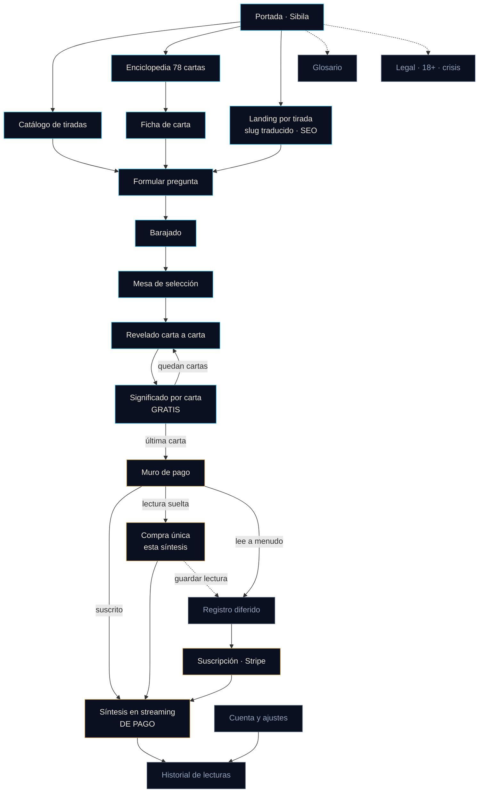

# Sibila — Plan de construcción v1

## 1. Contexto

Partimos de cero en `C:\Users\angel\Desktop\astrosoul` (directorio vacío, sin git). La Fase 1 de investigación está cerrada y publicada: auditoría de campo de Tarotoo y Astrolink, 41 casos de uso, 94 pantallas, decodificación de su sistema de animación y 13 defectos corregidos del informe aportado.

**El hueco confirmado:** nadie integra tarot y astrología. Tarotoo tiene el mejor tarot del mercado y ninguna astrología; su web solo usa 22 arcanos mayores siempre al derecho y no hace streaming de la interpretación. Astrolink tiene astrología decente y un tarot que en web es un artículo de blog con foto de stock. Tarotoo optimiza captación y renuncia a retención; Astrolink optimiza retención tras un muro de registro duro.

**Decisiones cerradas:**

| Decisión           | Elección                                                                                                                                      |
| ------------------ | --------------------------------------------------------------------------------------------------------------------------------------------- |
| Alcance v1         | Solo tarot, excelente. Astrología a la v2                                                                                                     |
| Plataforma         | Web primero, app después                                                                                                                      |
| Monetización       | Significado individual de cada carta gratis al revelarse; **la síntesis conjunta es de pago**, con **suscripción y compra única** conviviendo |
| Contenido gratuito | Texto curado ya escrito, sin IA. Coste marginal cero                                                                                          |
| Autoría del corpus | Lo escribe Claude siguiendo el método de §4A.4, con revisión experta de una muestra                                                           |
| Almacén del corpus | **Estático, versionado en git**, servido desde el edge. Postgres solo para lo mutable                                                         |
| Cumplimiento       | Se construye técnicamente en el proyecto; los textos legales los valida un abogado antes de facturar                                          |
| Animación          | 3D real en escritorio con **secuencias pre-renderizadas por carta** que produce el usuario; móvil sin 3D                                      |
| Marca              | **Sibila** — la oráculo es la marca                                                                                                           |
| Estética           | Holograma de sibila antigua, tipo VIKI de _Yo, Robot_. Místico y moderno, con detalle ornamental superior al de Tarotoo                       |
| Idiomas            | **Multiidioma desde la arquitectura**, contenido progresivo                                                                                   |
| Tema               | Oscuro comprometido en el producto; claro solo en superficies de lectura (§5)                                                                 |

**Cambio de stack respecto a la Fase 1:** sin astrología en la v1 no hay efemérides, y sin efemérides desaparece la única razón para introducir Python. **La v1 es todo TypeScript.** Python entra en la v2 con Swiss Ephemeris.

---

## 2. Marca y concepto

**Sibila.** Las profetisas de la antigüedad — Delfos, Cumas —, pintadas por Miguel Ángel en la Sixtina. Funciona igual en español, portugués, italiano e inglés. La marca y el personaje son lo mismo: el producto es _ella_.

**El concepto en una frase:** una sibila antigua proyectada como holograma en una cámara oscura.

| Capa fría — el proyector                     | Capa cálida — lo proyectado             |
| -------------------------------------------- | --------------------------------------- |
| Azul holográfico luminoso                    | Oro antiguo                             |
| Barrido, aberración cromática, interferencia | Grabado, glifos, filigrana              |
| Cristal, rejilla en fuga, luz volumétrica    | Pergamino, arcanos, símbolos alquímicos |
| Máquina, presente                            | Tradición, antigüedad                   |

La regla que sostiene la coherencia en cada pantalla: **lo holográfico es azul y emite luz; lo antiguo es oro y la refleja.** Se cruzan en un solo punto deliberado — el borde de las cartas al revelarse, donde el oro capta el azul de la proyección.

---

## 3. Sistema de diseño

### 3.1 Paleta

El violeta entra con justificación física, no decorativa: un holograma real separa el espectro en los bordes, y esa aberración cromática va del violeta al rosa. Es la física del concepto, lo que impide que se sienta añadido porque sí.

```
/* La cámara — fondos */
--vacio        #050912   negro azulado, el fondo de la proyección
--camara       #0A1020   superficie base
--nicho        #121A2E   superficie elevada
--borde        #1E2A45   separadores

/* El holograma — luz emitida */
--holo-nucleo  #7FE9FF   núcleo de la luz, máximo brillo
--holo         #3BC4F2   azul holográfico primario
--holo-hondo   #1B6FA8   holograma en reposo o profundidad
--fisura       #A66BFF   violeta de aberración cromática
--fisura-rosa  #E85FBF   extremo rosa de la separación · uso muy escaso

/* Lo antiguo — luz reflejada */
--oro          #D4A552   oro antiguo
--oro-vivo     #F2D394   oro captando la proyección
--oro-hondo    #8A6A2E   oro en sombra, para grabados

/* Texto */
--pergamino    #EDE7DA   principal · cálido, contrasta con el frío del fondo
--bruma        #93A3BC   secundario
--tenue        #5A6B85   terciario

/* Semánticos, separados del acento */
--exito #4FD8A0   --aviso #E8B55C   --error #FF6B7A
```

El fondo nunca es negro puro: `#050912` tiene sesgo azul, que es lo que hace que el azul holográfico emita en lugar de flotar. Todo el resplandor es aditivo.

### 3.2 Tema claro y oscuro

Analizado, y la respuesta no es simétrica.

**El producto es oscuro y no se negocia.** Un holograma es emisivo: necesita oscuridad para leerse como tal. Una versión clara de la mesa de lectura no sería el mismo producto peor, sería otro producto. Igual que nadie pide modo claro en una sala de cine.

**Pero hay superficies cuyo trabajo es que se lea texto largo**, y ahí el fondo oscuro sí perjudica: enciclopedia de cartas, glosario, artículos, legal, ajustes. Son además una parte importante del tráfico orgánico.

La resolución:

| Superficie                                                                | Tema                                     | Motivo                   |
| ------------------------------------------------------------------------- | ---------------------------------------- | ------------------------ |
| Portada, catálogo, lectura completa, muro, síntesis                       | **Solo oscuro**                          | Es el concepto           |
| Enciclopedia, ficha de carta, glosario, artículos, legal, ajustes, cuenta | **Oscuro por defecto, claro disponible** | Su trabajo es que se lea |

Más un **modo de lectura** transversal que sube contraste, agranda el cuerpo de texto y desactiva ornamentos, disponible en cualquier página. Cubre la necesidad de accesibilidad sin romper el concepto en ningún punto.

Implementación: tokens en `:root` para el tema oscuro, redefinición bajo `[data-tema="claro"]`, y las superficies de solo oscuro simplemente no exponen el conmutador. Los componentes leen siempre tokens, nunca literales.

### 3.3 Tipografía

| Rol            | Familia                | Uso                                                                                     |
| -------------- | ---------------------- | --------------------------------------------------------------------------------------- |
| Display        | **Cormorant Garamond** | Titulares, nombres de cartas. Serif de alto contraste renacentista: la voz de la sibila |
| Texto          | **Inter Tight**        | Cuerpo e interfaz. Sans moderno neutro: la voz de la máquina                            |
| Datos y glifos | **JetBrains Mono**     | Contadores, versalitas, el efecto de decodificación                                     |

La pareja serif-antiguo contra sans-técnico repite el concepto en la tipografía. **Verificar antes de fijarlas** que ambas cubren `¿ ¡ ñ á é í ó ú ü` y los diacríticos del portugués `ã õ ç â ê ô à` — es requisito de multiidioma, no un detalle.

---

## 4. Multiidioma

Requisito nuevo y con más consecuencias de las que parece.

### 4.1 Qué idiomas y cuándo

Del análisis de Fase 1: español y portugués son los mercados de mayor volumen y menor competencia; Astrolink domina Brasil; Tarotoo cubre seis idiomas.

**La arquitectura soporta N idiomas desde la primera línea. El contenido llega por fases**, porque el cuello de botella no es el código sino el corpus:

1. **Español** al lanzamiento
2. **Portugués** inmediatamente después — es el mercado donde Astrolink es batible
3. **Inglés** a continuación — mayor mercado, mayor competencia
4. Francés, italiano y alemán quedan preparados sin compromiso de fecha

### 4.2 Dos problemas distintos que no se mezclan

| Problema                                                                 | Solución                                                                                                         |
| ------------------------------------------------------------------------ | ---------------------------------------------------------------------------------------------------------------- |
| **Cadenas de interfaz** — botones, etiquetas, errores                    | Catálogos de mensajes con `next-intl`, versionados en el repositorio                                             |
| **Corpus interpretativo** — significados por carta y familia de posición | Ficheros estáticos por idioma, versionados en git. Ver §4A. No son cadenas de interfaz y no se tratan como tales |
| **Síntesis generada**                                                    | El idioma es parte del contexto del modelo; se genera directamente en la lengua del usuario, nunca se traduce    |

### 4.3 Rutas y SEO

Tarotoo no usa solo prefijo de idioma, usa **slug traducido** — `/es/tarot-gratis`, `/fr/tarot-gratuit` — y es lo correcto: la palabra clave está en la URL en cada mercado. Lo copiamos.

- Segmento `[idioma]` en el App Router, con mapa de slugs por idioma y por tirada
- `hreflang` recíproco entre todas las variantes, más `x-default`
- Sitemap por idioma
- Detección por `Accept-Language` solo para **sugerir**, nunca para redirigir a la fuerza: una redirección automática rompe el rastreo de los buscadores
- Selector de idioma persistente que conserva la página equivalente, no que te devuelve a la portada

### 4.4 Consecuencia sobre el corpus

Ver §4A, que es donde vive el diseño completo del corpus. Basta retener aquí que el corpus se multiplica por idioma y que por eso el contenido llega por fases aunque la arquitectura las soporte todas desde el principio.

---

## 4A. El corpus

Es el activo más valioso del producto, el más lento de producir y el que no se puede acelerar al final. Merece diseño propio.

### 4A.1 La posición es una lente, no un atributo de la tirada

El hallazgo que define la arquitectura: **«pasado» en Tres Cartas y «pasado reciente» en la Cruz Celta son la misma lente interpretativa.** Igual que «qué te frena» en la de cinco y «el cruce» en la Cruz Celta. La posición modifica la lectura de la carta, pero las modificaciones son temáticas y se repiten entre tiradas.

Por tanto el corpus **no se organiza por tirada sino por familia de posición**. Las siete tiradas contempladas suman 28 posiciones, pero solo 13 familias distintas:

| #   | Familia                                   | Posiciones que cubre                                          |
| --- | ----------------------------------------- | ------------------------------------------------------------- |
| 1   | Situación · presente · corazón del asunto | Presente, Situación, Dónde estás ahora, Carta 1 de la Cruz    |
| 2   | Obstáculo · cruce · lo que frena          | Obstáculo, Qué puede frenarte, El cruce                       |
| 3   | Pasado · influencia previa · raíz         | Pasado, Pasado reciente, Fundamento, Cómo te afecta lo vivido |
| 4   | Futuro cercano · lo que viene             | Futuro, Futuro cercano                                        |
| 5   | Resultado · potencial · desenlace         | Resultado, Tu potencial                                       |
| 6   | Consejo · acción recomendada              | Consejo, Qué hacer                                            |
| 7   | Recurso · fortaleza                       | Tus fortalezas                                                |
| 8   | A trabajar · debilidad · sombra           | Debilidades, En qué necesitas trabajar                        |
| 9   | Interior · esperanzas y miedos            | Tú mismo, Esperanzas y miedos, Amor propio                    |
| 10  | Entorno · influencias externas            | Entorno, Cómo te ven                                          |
| 11  | Aporte al vínculo · rol relacional        | Lo que aportas a tus relaciones                               |
| 12  | Respuesta general                         | Tirada de una carta · usa el significado base sin lente       |
| 13  | Valencia sí/no                            | Tirada Sí/No                                                  |

La consecuencia estratégica: **añadir una tirada nueva cuyas posiciones caigan en familias existentes cuesta cero corpus.** Convierte «más tiradas» en una función barata de forma permanente.

### 4A.2 Volumen real

| Capa                 | Piezas                         | Extensión                           | Nota                                           |
| -------------------- | ------------------------------ | ----------------------------------- | ---------------------------------------------- |
| Significado base     | 78 × 2 orientaciones = **156** | 3-5 frases                          | El cimiento; se reutiliza en todas las lentes  |
| Matiz por familia    | 78 × 11 × 2 = **1.716**        | 1-2 frases                          | Las familias 12 y 13 no necesitan matiz propio |
| Valencia sí/no       | **78**                         | Una palabra más justificación breve |                                                |
| **Total por idioma** | **~1.950**                     | ~95.000 palabras                    |                                                |

### 4A.3 Recomendación de alcance: cuatro tiradas al lanzamiento

De esa tabla se deriva una decisión de alcance. Lanzar con **una carta, sí/no, tres cartas y cinco general** reduce a 7 familias y unas **1.250 piezas**, un tercio menos de corpus.

La Cruz Celta por sí sola arrastra cuatro familias exclusivas — fundamento, corona, entorno, esperanzas y miedos — y es la tirada más cara en contenido de todo el catálogo. Guardarla como primera incorporación posterior al lanzamiento reduce el riesgo de la v1 y proporciona algo concreto que anunciar. Las tiradas de Situación-Obstáculo-Consejo y Cinco Amor entran con ella.

### 4A.4 Método de producción

Mil novecientas piezas escritas sin método derivan de voz mucho antes de la mitad. El orden importa:

1. **Guía de voz canónica.** Tono, persona, longitudes por capa y léxico prohibido — nada de «predice», «sucederá» o «te va a pasar», ni consejo médico, legal, financiero o psicológico. Es el documento contra el que se valida todo lo demás, y se escribe antes que la primera pieza.
2. **Los 156 significados base.** Cimiento reutilizable; es donde se juega la calidad.
3. **Por lente, no por carta.** Escribir las 78 cartas a través de una misma lente de una vez produce una consistencia que escribir una carta a través de once lentes no alcanza nunca.
4. **Validación automática por lote**, en el mismo `npm run verificar`: límites de longitud, léxico prohibido, cumplimiento del glosario, campos vacíos, y **detección de texto duplicado entre cartas**, que es la señal delatora de escritura cansada.
5. **Revisión experta de una muestra estratificada del 10 %** por un lector de tarot. No por corrección de la tradición, sino porque un experto detecta problemas de autenticidad de voz que ninguna validación automática ve.

### 4A.5 Formato y almacén

Estático y versionado en git, partido por idioma y por capa, servido desde el edge. Razones:

- **Latencia cero y coste cero** en el camino gratuito, que es requisito del modelo de negocio y no una preferencia.
- **Revisable por pull request**, con historial de cada cambio de cada significado.
- **Cacheable indefinidamente** en el CDN; cambia solo con despliegue.

Postgres queda para lo mutable: cuentas, lecturas guardadas, suscripciones. El corpus no es de esos.

Contrapartida aceptada: corregir una errata exige despliegue. Es asumible con despliegue continuo y se prefiere a pagar una consulta a base de datos en cada carta revelada.

---

## 5. Mapa de pantallas y navegación



**Navegación principal:** Tiradas · Cartas · Mi historial · [selector de idioma] · [cuenta]. El flujo de lectura es de pantalla completa sin navegación visible una vez comienza el barajado: la ceremonia no se interrumpe.

**Tiradas al lanzamiento:** Una carta · Sí/No · Tres cartas Pasado-Presente-Futuro · Cinco cartas general. Cuatro, por el cálculo de corpus de §4A.3.

**Primera incorporación posterior:** Cruz Celta de diez · Situación-Obstáculo-Consejo · Cinco cartas amor. El motor las soporta desde el día uno; lo que falta es corpus, no código.

Todas comparten motor con definición declarativa: identificador, número de cartas, posiciones con su familia de lente, disposición y reglas de interpretación. **Una tirada nueva es un fichero de definición más el corpus de las familias que no existan todavía.**

**Fuera de la v1:** todo lo astrológico, chat de seguimiento, diario, app nativa, Tarot Companion. El barajado verificable pasa a v1.1.

---

## 6. Inventario de animaciones

Lo que el usuario pide igualar y superar de Tarotoo. Tres velocidades con tres significados, tomadas de su lección de tempo: **ritual** (3–5 s, imparable), **agencia** (bajo 300 ms, responde al dedo), **revelación** (1,5–2,5 s, más lento que la lectura).

Curvas base: entrada `cubic-bezier(.16,1,.3,1)` · salida `cubic-bezier(.7,0,.84,0)` · ritual `cubic-bezier(.3,0,.14,1)`, medida directamente de Tarotoo.

### 6.1 Portada y ambiente

| #   | Animación                                                                           | Disparo     | Duración      | Técnica               | Prio  |
| --- | ----------------------------------------------------------------------------------- | ----------- | ------------- | --------------------- | ----- |
| 1   | Encendido de la proyección: cámara oscura → rejilla se dibuja → cono de luz se abre | Carga       | 2,4 s         | GSAP timeline         | Alta  |
| 2   | Materialización de Sibila: barrido de abajo arriba, interferencia, estabilización   | Tras #1     | 1,8 s         | Shader + máscara      | Alta  |
| 3   | Respiración del holograma: oscilación mínima de opacidad y escala                   | Continua    | 6 s bucle     | CSS                   | Alta  |
| 4   | Anillos de astrolabio concéntricos a velocidades distintas                          | Continua    | 40–120 s      | CSS rotate            | Alta  |
| 5   | Motas de polvo suspendidas en el haz                                                | Continua    | —             | Un canvas, partículas | Alta  |
| 6   | Interferencia: bandas de desplazamiento horizontal                                  | Cada 8–15 s | 180 ms        | Animación por pasos   | Media |
| 7   | Paralaje de ratón sobre toda la escena                                              | Movimiento  | —             | Transform, suavizado  | Media |
| 8   | Rejilla en fuga con deriva muy lenta                                                | Continua    | 60 s          | CSS                   | Baja  |
| 9   | Decodificación del titular: glifos → letras                                         | Entrada     | 1,6 s         | JS por carácter       | Alta  |
| 10  | Aparición escalonada de las tiradas                                                 | Scroll      | 0,6 s + 80 ms | GSAP stagger          | Media |

### 6.2 Pregunta

| #   | Animación                                                       | Disparo     | Duración | Técnica               | Prio  |
| --- | --------------------------------------------------------------- | ----------- | -------- | --------------------- | ----- |
| 11  | Encendido del borde del campo, fresnel                          | Foco        | 240 ms   | CSS                   | Alta  |
| 12  | Llenado del contador de caracteres                              | Al escribir | —        | CSS width             | Media |
| 13  | Sibila intensifica su luz mientras escribes                     | Al escribir | 400 ms   | Opacidad shader       | Media |
| 14  | La pregunta se desmaterializa en glifos y asciende hacia Sibila | Enviar      | 1,2 s    | GSAP + decode inverso | Alta  |

### 6.3 Barajado y abanico

| #   | Animación                                                     | Disparo  | Duración  | Técnica                    | Prio  |
| --- | ------------------------------------------------------------- | -------- | --------- | -------------------------- | ----- |
| 15  | El mazo llega apilado desde fuera de plano                    | Tras #14 | 0,9 s     | GSAP                       | Alta  |
| 16  | Barajado con corte y cascada, sincronizado con sonido         | Auto     | 1,8 s     | GSAP timeline              | Alta  |
| 17  | **Despliegue en abanico** — ritual, escalonado por índice     | Tras #16 | 4,8 s     | `cubic-bezier(.3,0,.14,1)` | Alta  |
| 18  | Respiración del abanico en reposo, para que no parezca muerto | Continua | 8 s bucle | CSS                        | Media |

### 6.4 Selección — donde superamos a Tarotoo

| #   | Animación                                                              | Disparo   | Duración  | Técnica              | Prio  |
| --- | ---------------------------------------------------------------------- | --------- | --------- | -------------------- | ----- |
| 19  | La carta bajo el cursor se eleva y gira hacia el espectador            | Hover     | 220 ms    | Transform            | Alta  |
| 20  | **Las vecinas se apartan** con caída por distancia, como una mano real | Hover     | 260 ms    | Transform escalonado | Alta  |
| 21  | Brillo de borde dorado al pasar por encima                             | Hover     | 180 ms    | Fresnel              | Alta  |
| 22  | La carta sale del abanico y vuela a su posición de tirada              | Clic      | 700 ms    | GSAP path            | Alta  |
| 23  | El abanico se recompone cerrando el hueco                              | Tras #22  | 500 ms    | Transform            | Alta  |
| 24  | Contador regresivo de cartas restantes                                 | Selección | 300 ms    | CSS                  | Media |
| 25  | Pulso en la posición vacía que toca cubrir                             | Continua  | 2 s bucle | CSS                  | Media |

El punto 20 es la microinteracción que más eleva el abanico y **Tarotoo no la hace**.

### 6.5 Revelado

| #   | Animación                                             | Disparo      | Duración  | Técnica             | Prio  |
| --- | ----------------------------------------------------- | ------------ | --------- | ------------------- | ----- |
| 26  | Volteo 3D de la carta                                 | Clic         | 600 ms    | ease-out-quint      | Alta  |
| 26b | _o_ clip pre-renderizado si está disponible           | Clic         | 1,5–2,5 s | Vídeo               | Alta  |
| 27  | Destello de revelación con partículas                 | Al voltear   | 400 ms    | Canvas              | Alta  |
| 28  | Nombre de la carta: ascenso de 80 px + decodificación | Tras #26     | 2,1 s     | GSAP + decode       | Alta  |
| 29  | Halo dorado captando el azul de la proyección         | Tras #26     | 800 ms    | Shader / box-shadow | Media |
| 30  | Aparición del significado, escalonada por líneas      | Tras #28     | 1,8 s     | Decode              | Alta  |
| 31  | Tratamiento diferenciado de carta invertida           | Si invertida | 600 ms    | Transform + tinte   | Media |

### 6.6 Muro y síntesis

| #   | Animación                                                | Disparo      | Duración | Técnica            | Prio  |
| --- | -------------------------------------------------------- | ------------ | -------- | ------------------ | ----- |
| 32  | Las cartas se atenúan y se agrupan                       | Última carta | 900 ms   | GSAP               | Alta  |
| 33  | Sibila se acerca y se intensifica                        | Tras #32     | 1,2 s    | Escala + luz       | Alta  |
| 34  | El panel de muro se materializa                          | Tras #33     | 700 ms   | Decode + fade      | Alta  |
| 35  | La síntesis asoma desenfocada detrás del muro            | Con #34      | —        | Blur + máscara     | Media |
| 36  | **Streaming del texto decodificándose según llega**      | Pago         | —        | Decode incremental | Alta  |
| 37  | Líneas de conexión entre cartas mostrando sus relaciones | Con #36      | 1,4 s    | SVG path draw      | Media |
| 38  | Sibila pulsa sincronizada con el streaming               | Con #36      | —        | Shader             | Baja  |

### 6.7 Transversales

| #   | Animación                                                      | Disparo    | Duración | Técnica              | Prio  |
| --- | -------------------------------------------------------------- | ---------- | -------- | -------------------- | ----- |
| 39  | Transición entre rutas                                         | Navegar    | 500 ms   | View Transitions API | Media |
| 40  | Línea de barrido cruzando la pantalla al cambiar de sección    | Navegar    | 600 ms   | CSS                  | Baja  |
| 41  | Anillo de astrolabio girando como indicador de carga           | Espera     | —        | SVG                  | Alta  |
| 42  | Botones: fresnel + desplazamiento de aberración                | Hover      | 160 ms   | CSS                  | Alta  |
| 43  | Cursor personalizado: punto de luz con halo                    | Movimiento | —        | Transform            | Baja  |
| 44  | Anillo holográfico de foco de teclado                          | Tab        | 120 ms   | CSS                  | Alta  |
| 45  | Revelado al hacer scroll en páginas de contenido               | Scroll     | 600 ms   | IntersectionObserver | Media |
| 46  | Sonido: barajar, seleccionar, voltear, revelar, muro, ambiente | Eventos    | —        | Web Audio API        | Media |

### 6.8 La decodificación de texto

Es la firma del producto y merece definición propia. En lugar del `wrapTextInSpans` de Tarotoo, que solo hace aparecer palabras, el texto se materializa resolviéndose: cada carácter cicla por glifos zodiacales y alquímicos antes de fijarse en su letra. Ata las dos mitades del concepto — símbolos antiguos decodificados por una máquina.

Reglas no negociables: el texto final existe en el DOM desde el principio, para que sea accesible e indexable; la animación es puramente visual sobre él. Con `prefers-reduced-motion` cae a fundido simple. Y debe probarse con acentos, `ñ`, `ç` y los diacríticos del portugués antes de darla por buena.

### 6.9 Presupuesto de rendimiento

Solo se animan `transform` y `opacity`. Objetivo de 60 fps sostenidos en un Android de gama media de tres años, con la síntesis llegando en streaming a la vez. Por debajo de un umbral medido en tiempo real, el post-proceso holográfico se desactiva y el ambiente cae a gradiente estático sin que se rompa nada. `will-change` se añade antes de animar y se retira en `transitionend` — Tarotoo lo deja permanente en 78 cartas, que es un error que no heredamos.

---

## 7. Proceso de diseño

El diseño va **antes** que los componentes, no en paralelo. Orden:

1. **Tokens** — color, tipografía, espaciado, curvas de movimiento, elevación. Se publican como página navegable del propio proyecto.
2. **Lienzo en Claude Design** — la skill `design` genera artboards múltiples editables. Se maquetan ahí las ocho pantallas clave (portada, catálogo, pregunta, abanico, revelado, muro, síntesis, ficha de carta) antes de escribir un componente.
3. **Biblioteca ornamental** — los diez ornamentos de §3 como componentes con su página de catálogo: barrido, cono volumétrico, motas, aberración, interferencia, anillos, rejilla, fresnel, filigrana, glifos.
4. **Catálogo de componentes** — botones, campos, panel, carta, posición de tirada, muro. Cada uno en sus estados y en ambos temas donde aplique.
5. **Solo entonces**, pantallas reales.

---

## 8. Arquitectura

### 8.1 Stack

| Capa              | Elección                            | Motivo                                                                                                     |
| ----------------- | ----------------------------------- | ---------------------------------------------------------------------------------------------------------- |
| Framework         | **Next.js, App Router**             | El SEO no es preferencia sino requisito: la captación de ambos competidores es orgánica pura               |
| Lenguaje          | **TypeScript estricto**             | `strict: true`, sin `any`                                                                                  |
| Idiomas           | **next-intl**                       | Integración nativa con App Router y con segmento `[idioma]`                                                |
| Estilos           | **CSS Modules + custom properties** | Resuelve de raíz la exigencia de especificidad controlada: ámbito local, sin guerra de cascada             |
| 3D escritorio     | **Three.js**                        | Escena de cartas, shader holográfico, post-proceso                                                         |
| Animación         | **GSAP**                            | Coreografías largas y sincronizadas; los timelines son justo lo que pide §6                                |
| Estado de lectura | Máquina de estados explícita        | Los estados son pocos y cerrados; no hace falta librería                                                   |
| Base de datos     | **PostgreSQL** (Neon o Supabase)    | Solo lo mutable: cuentas, lecturas, compras, auditoría de generaciones. **El corpus no vive aquí** (§4A.5) |
| Pagos             | **Stripe**                          | Suscripción web. RevenueCat cuando llegue la app                                                           |
| Despliegue        | **Vercel**                          | Encaja con Next.js y con el presupuesto de una v1                                                          |

### 8.2 Separación renderizador / motor

La decisión estructural más importante. El usuario quiere comportamientos distintos en escritorio y móvil; si eso se implementa como dos versiones del producto, se duplica el trabajo y las reglas divergen.

```
motor-de-lectura/          agnóstico de presentación
  MazoDeCartas             barajado, reparto, estado de cada carta
  DefinicionDeTirada       posiciones, número de cartas, disposición
  MaquinaDeEstadosLectura  reposo → barajando → seleccionando →
                           revelando → sintetizando → completada
  ServicioDeInterpretacion consulta de significados y llamada de síntesis
  BusDeEventos             desacopla motor de renderizadores

renderizadores/
  RenderizadorTridimensional   escritorio · Three.js · abanico en perspectiva,
                               shader holográfico, paralaje, arrastre, clips
  RenderizadorPlano            móvil · transformaciones CSS 3D · abanico
                               aplanado, deslizamiento táctil, sin WebGL
```

Ambos consumen el mismo motor y emiten los mismos eventos. La elección se hace por capacidad detectada — puntero grueso, memoria del dispositivo, ausencia de WebGL2 — no solo por ancho, con conmutador manual en ajustes.

### 8.3 El abanico

**El problema de las 78 cartas.** Tarotoo abanica 22 a 5° cada una, arco de 110°. Con 78 ese paso daría 390°, imposible. Paso angular dinámico:

```
pasoAngular = min(5°, arcoDisponible / (numeroDeCartas − 1))
```

Con 78 sobre 110° salen 1,43° por carta: muy solapadas, con una franja visible de cada una. Es el aspecto de un abanico real de 78 cartas y se elige por la franja, así que es correcto.

**Selección analítica, no por raycast.** Como el arco es determinista, el índice bajo el cursor se deduce del ángulo respecto al pivote: O(1), exacto, y no sufre con el solapamiento.

**Orden de profundidad explícito** por índice: no existe z-fighting posible.

**Coste real:** en el abanico todas las cartas están boca abajo y **el dorso es la misma textura para las 78**. El abanico completo es una sola llamada de dibujo instanciada. Solo las reveladas necesitan textura propia y nunca pasan de diez. La escena es barata pese a las 78 cartas.

### 8.4 Presupuesto de peso, separado del de fps

El presupuesto de 60 fps de §6.9 no cubre el problema de carga inicial, y son conflictos distintos. Three.js y GSAP juntos son varios cientos de kilobytes; cargarlos en una landing de SEO destroza el LCP, y las landings son toda la estrategia de captación.

**Regla de arquitectura:** las rutas de contenido —portada, landings por tirada, enciclopedia, fichas, glosario, legal— **no cargan Three.js ni GSAP**. Solo las rutas de lectura los importan, y de forma diferida. Se verifica en compilación con un límite de peso por ruta, porque es exactamente el tipo de regla que se incumple en silencio.

Objetivos separados: **Core Web Vitals** en las rutas de contenido (LCP, INP, CLS), **60 fps** en las rutas de lectura.

### 8.5 Modelo de datos

El corpus es estático (§4A.5) y no vive aquí. Postgres guarda solo lo mutable:

| Entidad        | Contenido                                                                   | Notas                                                            |
| -------------- | --------------------------------------------------------------------------- | ---------------------------------------------------------------- |
| `usuarios`     | Identidad, idioma preferido, fecha de alta                                  | Registro diferido: existe sin cuenta hasta que se quiere guardar |
| `lecturas`     | Tirada, pregunta, cartas con posición y orientación, idioma, marca temporal | **La síntesis se persiste aquí**, no solo se emite               |
| `compras`      | Compra única o suscripción, proveedor, identificador externo, estado        | Suscripción y pago suelto conviven                               |
| `generaciones` | Versión de prompt, modelo, proveedor, tokens, latencia, estado              | Auditoría. Permite reproducir y comparar calidad entre versiones |

Dos decisiones que conviene fijar desde el esquema:

- **La síntesis se persiste transaccionalmente con el cobro.** Si el usuario cierra la pestaña a mitad del streaming, la recupera en el historial. Sin esto, cada corte de red es una reclamación.
- **La versión de prompt y el modelo se guardan en cada generación.** Cuando cambiemos de modelo, hay que poder responder a «esta lectura de hace tres meses, ¿con qué se generó?».

---

## 9. Pipeline de assets — el riesgo principal

Setenta y ocho clips pre-renderizados es el mayor riesgo técnico y necesita reglas cerradas antes de producir el primero.

### 9.1 Especificación de entrega

| Parámetro   | Valor                                                           | Razón                                                                                                                                                                                                                                                                                                                                                              |
| ----------- | --------------------------------------------------------------- | ------------------------------------------------------------------------------------------------------------------------------------------------------------------------------------------------------------------------------------------------------------------------------------------------------------------------------------------------------------------ |
| Formato     | **AV1 en MP4** · VP9 en WebM · **H.264 como suelo obligatorio** | Sin canal alfa: la animación vive dentro del rectángulo, lo que mejora mucho la compresión. H.264 no es opcional: en el «Android de gama media de tres años» del presupuesto de rendimiento, decodificar AV1 por software cuesta CPU justo mientras corren el abanico y el streaming, y el soporte de AV1 en Safari ha sido irregular. Pesa más y siempre funciona |
| Resolución  | 720 × 1260                                                      | Una carta ocupa como máximo unos 400 × 700 px CSS; sobra a 2×                                                                                                                                                                                                                                                                                                      |
| Duración    | 1,5 – 2,5 s                                                     | Debe terminar antes de que se pierda el interés                                                                                                                                                                                                                                                                                                                    |
| Peso máximo | **400 KB por clip**, verificado en compilación                  | 78 × 400 KB = 31 MB de catálogo, nunca cargado entero                                                                                                                                                                                                                                                                                                              |
| Póster      | WebP del primer fotograma, bajo 30 KB                           | Se pinta al instante mientras el clip carga                                                                                                                                                                                                                                                                                                                        |
| Bucle       | El último fotograma coincide con el estado de reposo            | Permite congelar al terminar sin salto                                                                                                                                                                                                                                                                                                                             |

### 9.2 Estrategia de precarga

La solución al tirón del primer volteo depende de una propiedad del flujo que conviene no perder: **el usuario selecciona todas las cartas antes de voltear ninguna.** En el instante de la selección ya sabemos qué clip hará falta.

1. Al seleccionar una carta se dispara su precarga con prioridad alta.
2. Mientras sigue eligiendo — varios segundos — los clips se almacenan.
3. Al voltear, el clip ya está en memoria y arranca sin latencia.
4. Si aun así no está listo, se ejecuta el volteo CSS 3D y se funde al clip cuando llegue. **El volteo nunca se bloquea esperando un asset.**

Probar con red limitada a 3G lento, no solo en local.

### 9.3 Riesgo abierto

Si los 78 clips no llegan a tiempo, el producto debe funcionar igual. Por eso el volteo CSS 3D no es una reserva de emergencia sino el **camino por defecto**, y el clip una mejora que se activa cuando existe. Un manifiesto declara qué cartas tienen clip; las que no, usan el volteo base sin degradación visible.

---

## 10. Monetización y fiabilidad del cobro

### 10.1 Dos caminos en el muro

La captación es orgánica: el visitante llega por primera vez desde un buscador y no conoce la marca. Pedirle una suscripción recurrente en ese momento deja conversión sobre la mesa, que es justo lo que hace Astrolink al vender el «Mapa do Amor» como compra suelta.

El muro ofrece los dos:

| Camino                            | Para quién                                       | Requiere cuenta                |
| --------------------------------- | ------------------------------------------------ | ------------------------------ |
| **Compra única de esta síntesis** | Visitante frío en su momento de máxima intención | No, hasta que quiera guardarla |
| **Suscripción**                   | Quien lee a menudo                               | Sí                             |

La compra única no necesita registro previo: se paga, se genera, y solo después se ofrece crear cuenta **para conservar la lectura**. Es el mismo principio de «valor antes que cuenta» que rige el resto del producto.

### 10.2 Qué pasa si se cobra y el modelo falla

Sin diseñar, esto es una reclamación y potencialmente un cargo revertido. La regla:

**Se reserva el pago, se genera, y solo se captura el cobro cuando la síntesis está completa y persistida.** Si la generación falla, se libera la reserva y no se cobra nada. Si falla a mitad del streaming, la lectura queda persistida como incompleta y se reintenta sin volver a cobrar.

Requisitos que se derivan: idempotencia en el endpoint de generación, reintento con límite, y un estado explícito de lectura `fallida` que la interfaz sepa mostrar sin culpar al usuario.

### 10.3 Proveedor de modelo

La síntesis es la única función monetizada y depende de un proveedor externo. **Un solo proveedor es un punto único de fallo sobre la única fuente de ingresos.** La capa de generación se abstrae desde el principio para poder conmutar, aunque en la v1 solo haya uno configurado.

---

## 11. Legal y cumplimiento

Los mercados objetivo son España, Portugal, Francia, Italia y Alemania: todo esto es obligatorio, no opcional. Se construye técnicamente en el proyecto; **los textos los valida un abogado antes de cobrar el primer euro.**

| Requisito                     | Qué implica construir                                                                                                                                                                                                                                                |
| ----------------------------- | -------------------------------------------------------------------------------------------------------------------------------------------------------------------------------------------------------------------------------------------------------------------- |
| **RGPD**                      | Exportación y borrado real de datos desde la cuenta, registro de tratamientos, minimización en logs                                                                                                                                                                  |
| **Consentimiento de cookies** | Banner con rechazo tan accesible como la aceptación; nada no esencial se carga antes del consentimiento                                                                                                                                                              |
| **Derecho de desistimiento**  | Toca directamente el flujo de pago: el contenido digital entregado de inmediato exige **consentimiento expreso renunciando a los 14 días**, recogido y registrado en el momento de la compra. Sin eso, cualquiera puede pedir devolución después de leer su síntesis |
| **IVA OSS**                   | Tipo impositivo por país en el checkout y factura conforme                                                                                                                                                                                                           |
| **Tratamiento por terceros**  | Las preguntas contienen material sensible. Hace falta acuerdo de tratamiento con el proveedor del modelo y decir con claridad en la política de privacidad que la pregunta sale hacia un tercero                                                                     |
| **Edad**                      | Ahora mismo es un texto. Hace falta puerta real: declaración de edad registrada antes de la primera lectura                                                                                                                                                          |

---

## 12. Seguridad, abuso y moderación

### 12.1 El corpus es rascable

Los significados son gratuitos, sin registro y sin límite. Tal cual está planteado, **cualquiera puede aspirar el corpus completo en los tres idiomas en unas horas** — el activo que este mismo plan llama el más valioso.

Mitigación: limitación de tasa por dirección y por sesión, los significados no alcanzables como endpoint directo fuera de una lectura en curso, y detección de patrones de recorrido sistemático. No lo hace imposible, lo hace caro.

### 12.2 La pregunta es texto libre que entra en un prompt

Dos problemas distintos:

- **Inyección de prompt.** La pregunta va al modelo junto al corpus. Hace falta separación estricta entre instrucción y dato, y verificación de la salida antes de mostrarla.
- **Moderación de entrada.** Qué ocurre si alguien escribe odio, contenido sexual con menores o amenazas. Se modera **antes** de llegar al modelo y antes de escribirse en ningún log.

### 12.3 Crisis

El encuadre del producto ya dice que los recursos de crisis deben ser accesibles, pero un enlace en el pie no es un mecanismo.

**Si la pregunta contiene lenguaje de ideación suicida o autolesión, el producto reacciona**: muestra recursos de ayuda de forma destacada y en el idioma del usuario, antes de continuar. Nunca se responde a una pregunta así barajando cartas como si nada. Es lo correcto, y además es lo que sostiene el producto ante tiendas de aplicaciones y pasarelas de pago.

---

## 13. Convenciones de código

Requisito explícito: código en español, legible, ordenado, documentado, «como una obra de arte».

### 13.1 Nomenclatura

| Elemento            | Convención                             | Ejemplo                                            |
| ------------------- | -------------------------------------- | -------------------------------------------------- |
| Clases y tipos      | PascalCase en español                  | `MazoDeCartas`, `DefinicionDeTirada`               |
| Métodos y funciones | camelCase en español, verbo primero    | `barajarMazo()`, `obtenerSignificadoPorPosicion()` |
| Variables           | camelCase descriptivo, sin abreviar    | `cartasSeleccionadas`, no `cartsSel`               |
| Constantes          | UPPER_SNAKE_CASE                       | `NUMERO_MAXIMO_DE_CARTAS`                          |
| Booleanos           | prefijo `es`, `esta`, `tiene`, `puede` | `estaRevelada`, `puedeSeleccionar`                 |
| Ficheros            | kebab-case                             | `mazo-de-cartas.ts`                                |
| Clases CSS          | camelCase en CSS Modules               | `.cartaRevelada`                                   |
| Eventos             | `dominio:accion`                       | `carta:revelada`, `lectura:completada`             |

Los identificadores técnicos consolidados se mantienen en inglés cuando traducirlos empeora la claridad: `useEffect`, `props`, `canvas`, `shader`.

### 13.2 Glosario de dominio

Fijar el vocabulario antes de escribir código es lo que impide que un código en español derive. Término único y obligatorio por concepto:

`baraja` (las 78 como conjunto) · `mazo` (la baraja en juego, barajada) · `carta` · `arcano` mayor o menor · `palo` · `orientación` derecha o invertida · `tirada` · `posición` · `barajar` · `repartir` · `seleccionar` · `revelar` · `significado` (texto curado) · `síntesis` (texto generado) · `lectura` (la sesión completa).

### 13.3 Reglas de estilo pedidas

- **`if`/`else` explícito**, no retorno anticipado. Donde eso genere anidamiento profundo se extrae un método con nombre descriptivo, en lugar de aplanar con returns: se obtiene la legibilidad buscada sin código en pirámide.
- **El bucle se elige por su semántica**: `for` para recorrer un número conocido de elementos, `while` cuando la condición se evalúa antes, `do/while` cuando el cuerpo debe ejecutarse al menos una vez.
- **Una responsabilidad por función**, y funciones que quepan en pantalla.
- **JSDoc en español** en todo lo público: qué hace, qué recibe, qué devuelve y por qué existe.
- **Especificidad CSS controlada** por CSS Modules. Prohibido `!important` y los anidamientos de más de dos niveles.

### 13.4 Cumplimiento mecánico

Lo automatizable no se deja a la disciplina:

- **ESLint** con TypeScript estricto. Importante: `no-else-return` debe quedar **desactivada**, porque impone justo lo contrario de lo pedido.
- **Stylelint** con límite de especificidad y prohibición de `!important`.
- **Prettier** para formato.
- **Husky** en pre-commit ejecutando las tres.
- **CLAUDE.md** en la raíz con este apartado 10 completo, cargado en cada sesión.

---

## 14. Skills y plugins

Estado verificado: el marketplace `claude-plugins-official` está registrado con 294 plugins, pero **no hay ninguno instalado** y `~/.claude/skills` está vacío. Los directorios sueltos en `~/.claude` (`frontend-architect`, `code-reviewer`, `superpowers`…) contienen `SKILL.md` pero no están en la ruta que Claude Code carga.

### Instalar en fase 0 — marketplace oficial

| Plugin                | Para qué aquí                                                                                |
| --------------------- | -------------------------------------------------------------------------------------------- |
| `frontend-design`     | Interfaz distintiva, evita la estética genérica de IA. Es justo el problema de este proyecto |
| `superpowers`         | Brainstorming, desarrollo con subagentes, depuración sistemática, TDD                        |
| `context7`            | Documentación por versión de Three.js y GSAP, que cambian rápido                             |
| `typescript-lsp`      | Inteligencia de tipos real                                                                   |
| `chrome-devtools-mcp` | Trazas de rendimiento reales. Imprescindible para sostener 60 fps con vídeo y WebGL a la vez |
| `playwright`          | End-to-end del flujo completo                                                                |

### Instalar en fase 0 — animación, marketplaces externos

| Marketplace                                                    | Contenido                                                                                                    | Confianza                                                                  |
| -------------------------------------------------------------- | ------------------------------------------------------------------------------------------------------------ | -------------------------------------------------------------------------- |
| `greensock/gsap-skills`                                        | Ocho skills oficiales de GSAP: core, timeline, ScrollTrigger, plugins, utils, React, rendimiento, frameworks | **Oficial de GreenSock**, MIT, 15,1k estrellas                             |
| `freshtechbro/claudedesignskills` → bundle `core-3d-animation` | Three.js/WebGL, GSAP ScrollTrigger, React Three Fiber, Motion, Babylon                                       | **Comunitario**, Apache-2.0. Código de terceros: revisar antes de instalar |

### Cuando toque

`stripe` con la suscripción · `neon` o `supabase` con la base de datos · `vercel` al desplegar · `resend` para correo · `posthog` para analítica y feature flags · `sentry` para errores · `semgrep` para análisis estático · `expo` con la app móvil.

### Claude Design

Disponible: es la skill `design` integrada, que genera un lienzo de artboards múltiples publicado como Artifact y editable visualmente. Es la herramienta del paso 2 de §7.

---

## 15. Fases de ejecución

| Fase                                 | Contenido                                                                                                                                                                               | Entregable                                                        |
| ------------------------------------ | --------------------------------------------------------------------------------------------------------------------------------------------------------------------------------------- | ----------------------------------------------------------------- |
| **0 · Cimientos** ✅                 | Repositorio y git, Next.js con TS estricto, ESLint/Stylelint/Prettier/Husky, CLAUDE.md, andamiaje de `next-intl` con segmento `[idioma]`, tokens, skills                                | Hecho. Proyecto que compila en tres idiomas, `verificar` en verde |
| **0B · Corpus, arranque**            | Guía de voz canónica · esquema del corpus por capas · validador automático integrado en `verificar` · **los 156 significados base en español**                                          | Cimiento del corpus y su red de seguridad                         |
| **1 · Diseño**                       | Tokens publicados como página · lienzo en Claude Design con las ocho pantallas clave · biblioteca ornamental · catálogo de componentes · **verificación de contraste AA de los tokens** | Catálogo navegable en ambos temas                                 |
| **2 · Motor**                        | Mazo, barajado, las cuatro tiradas de lanzamiento, familias de posición, máquina de estados, bus de eventos. Sin interfaz, con pruebas                                                  | Motor probado                                                     |
| **3 · Renderizador plano**           | Abanico CSS, selección, volteo, revelado, **modo de selección en lista para lector de pantalla**. Móvil primero: es el camino por defecto y la reserva de escritorio                    | Lectura completa jugable en móvil                                 |
| **4 · Renderizador 3D**              | Escena Three.js, abanico en perspectiva, shader holográfico, separación al hover, paralaje, integración de clips                                                                        | Lectura completa en escritorio                                    |
| **5 · Contenido e IA**               | Corpus de las 7 familias de lanzamiento · síntesis en streaming · moderación de entrada y detección de crisis · abstracción de proveedor · persistencia de la síntesis                  | Lectura con interpretación real                                   |
| **6 · Portada y SEO**                | Hero con Sibila, landings por tirada con slug traducido, enciclopedia, `hreflang`, sitemaps, datos estructurados, presupuesto de peso por ruta                                          | Web pública multiidioma                                           |
| **7 · Cuentas, pago y cumplimiento** | Registro diferido, muro con doble camino, Stripe, reserva-genera-captura, historial, **bloque legal completo**, Sentry y analítica                                                      | Producto monetizado y conforme                                    |
| **8 · Segundo idioma**               | Portugués: corpus, cadenas, slugs, sitemap. **Verificar cobertura de PIX antes de dar por buena la tesis de Brasil**                                                                    | Mercado de Brasil abierto                                         |
| **9 · Ampliación de catálogo**       | Cruz Celta, Situación-Obstáculo-Consejo, Cinco Amor: 4 familias nuevas de corpus                                                                                                        | Siete tiradas                                                     |

Las fases 3 y 4 son secuenciales a propósito: el renderizador plano define el contrato que el 3D debe cumplir.

**El corpus corre en paralelo desde la fase 0B y es lo único que no puede acelerarse al final.** La fase 5 lo consume; si no está, no hay producto.

**Sentry y analítica entran en la fase 7, no después.** Es cuando empieza a entrar dinero, y pagos sin trazabilidad de errores es la peor combinación posible.

### 15.1 Validación antes de comprometer las 46 animaciones

La estética holográfica es una apuesta creativa que nadie ha probado con usuarios reales. Entre la fase 1 y la fase 3 conviene intercalar una **prueba con usuarios del héroe y una lectura de una sola carta** — lo mínimo que transmite el concepto — antes de invertir en el inventario completo de movimiento. Si la dirección no conecta, es mucho más barato saberlo ahí.

---

## 16. Verificación

- **Motor:** pruebas unitarias del barajado — distribución uniforme sobre muchas iteraciones, sin el sesgo clásico de Fisher-Yates mal implementado —, de las reglas de selección y de cada transición de estado.
- **Rendimiento:** traza de Chrome DevTools durante una lectura completa en escritorio con post-proceso activo, y en perfil de móvil de gama media. Criterio: ninguna caída por debajo de 55 fps durante el reparto ni el revelado.
- **Assets:** verificación en compilación de que ningún clip supera 400 KB y de que todo clip del manifiesto existe.
- **Precarga:** con red a 3G lento, el volteo nunca se bloquea y la reserva CSS entra limpia.
- **Extremo a extremo con Playwright:** recorrido de portada a muro, en escritorio y móvil, incluido el caso de clips ausentes.
- **Multiidioma:** cada ruta responde en los idiomas activos, `hreflang` recíproco correcto, el selector conserva la página equivalente, y la decodificación de texto se comporta bien con acentos, `ñ` y `ç`.
- **Accesibilidad:** abanico navegable por teclado completo, **modo de selección en lista verificado con lector de pantalla real** —un abanico de 78 cartas solapadas es una metáfora visual sin equivalente auditivo, y ponerle ARIA encima no lo resuelve—, texto en el DOM antes de la animación, recorrido íntegro con `prefers-reduced-motion`, contraste AA en ambos temas, y modo de lectura funcional.
- **SEO:** landings y fichas renderizadas en servidor con contenido completo, datos estructurados válidos, y **peso de JavaScript por ruta dentro del límite** — ninguna ruta de contenido carga Three.js ni GSAP.
- **Corpus:** el validador pasa en cada lote — longitudes, léxico prohibido, glosario, sin campos vacíos y sin texto duplicado entre cartas.
- **Cobro:** una generación fallida no captura el pago; una lectura interrumpida a mitad de streaming se recupera íntegra desde el historial; el endpoint de generación es idempotente.
- **Moderación:** una pregunta con lenguaje de crisis muestra recursos antes de continuar, en el idioma del usuario. Una pregunta con inyección de prompt no altera el comportamiento del modelo.
- **Abuso:** el recorrido sistemático de significados encuentra limitación de tasa.

---

## 17. Riesgos

| Riesgo                                                   | Mitigación                                                                                                                                                                                |
| -------------------------------------------------------- | ----------------------------------------------------------------------------------------------------------------------------------------------------------------------------------------- |
| Los 78 clips no se producen a tiempo                     | El volteo CSS 3D es el camino por defecto, no la reserva. Manifiesto declara qué cartas tienen clip                                                                                       |
| Dos renderizadores duplican el trabajo                   | Motor agnóstico compartido; los renderizadores solo pintan                                                                                                                                |
| **El corpus multiidioma se come el proyecto**            | Organización por familia de lente y no por tirada, que reduce 28 posiciones a 13 familias. Cuatro tiradas al lanzamiento en vez de siete. Un idioma al lanzamiento. Arranca en la fase 0B |
| La versión gratuita se percibe peor que la de Tarotoo    | Significado curado **por posición**, más rico que el suyo, y 78 cartas con inversiones gratis desde el día uno, que Tarotoo no ofrece en web                                              |
| Coste de IA descontrolado                                | Solo la síntesis usa modelo, y solo tras el pago. Lo gratuito es consulta a tabla                                                                                                         |
| La estética holográfica cae en cliché                    | Disciplina azul-frío contra oro-cálido; el violeta solo como aberración cromática; la interferencia como suceso raro, nunca como fondo continuo                                           |
| El tema claro rompe el concepto                          | No se ofrece en las superficies del producto, solo donde el trabajo es leer texto largo                                                                                                   |
| **La voz del corpus deriva antes de la pieza 500**       | Guía canónica escrita antes que la primera pieza · escritura por lente y no por carta · validador que detecta duplicados · revisión experta del 10 %                                      |
| **El corpus se rasca y deja de ser un activo**           | Limitación de tasa, significados no alcanzables fuera de una lectura en curso, detección de recorrido sistemático                                                                         |
| **Se cobra y la generación falla**                       | Reserva, genera, y solo entonces captura. Síntesis persistida antes del cobro                                                                                                             |
| Caída del proveedor de modelo deja sin ingresos          | Capa de generación abstraída desde el principio, aunque la v1 configure uno solo                                                                                                          |
| Sanción por incumplimiento en la UE                      | Bloque legal como requisito de la fase 7, con validación de abogado antes de facturar                                                                                                     |
| AV1 ahoga la gama media                                  | H.264 como suelo obligatorio, no como reserva teórica                                                                                                                                     |
| Las landings de SEO cargan el peso de la sala de lectura | Límite de peso por ruta verificado en compilación                                                                                                                                         |
| «Sibila» ya está tomada como marca                       | Comprobación de marca y dominio **antes** de invertir en identidad visual                                                                                                                 |
